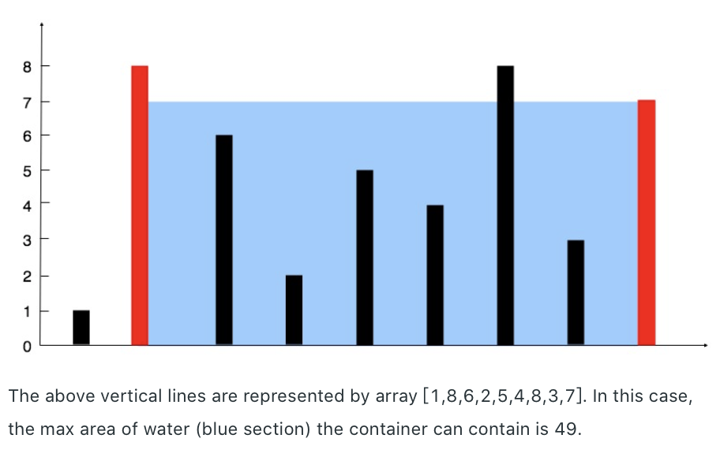

11. Container With Most Water     --Medium

    Given *n* non-negative integers *a1*, *a2*, ..., *an* , where each represents a point at coordinate (*i*, *ai*). *n* vertical lines are drawn such that the two endpoints of line *i* is at (*i*, *ai*) and (*i*, 0). Find two lines, which together with x-axis forms a container, such that the container contains the most water.

    **Note:** You may not slant the container and *n* is at least 2.

    

    **Example:**

    ```
    Input: [1,8,6,2,5,4,8,3,7]
    Output: 49
    ```

    **Solution:**

    11.1 brute-force solution: using two loops to calculate all possible collocations to figure out the maxmium capacity.

    ```java
    public int maxArea(int[] height) {
            int max = 0;
            for(int i=0; i<height.length; i++)
                for(int j=i+1;j<height.length;j++){
                    int curArea = Math.min(height[i],height[j]) * (j-i);
                    max = Math.max(max, curArea);
                }
            return max;
        }
    ```

    11.2 use two pointers to point to the head and tail. Move a pointer with smaller value. Since the height of the container is the minimum value of two pointers, thus if we move the bigger value pointer, the length of the container is going to become smaller and the height will not become bigger:

    **Analysis:**

    11.2.1  

    + If we move the bigger pointer, the length of container will become shorter, the value of height will not become bigger. Thus, the total capacity will become smaller:
         + If the next value is bigger, the height is the same as before
         + If the next value is smaller, the height is the next value, which is smaller than the original value

    + If we move the smaller pointer, the length of container will become shorter, the value of height is not sure. Thus the total capacity id not sure too:
      + If the next value is bigger, the height is the next value, which is bigger than the original value
      + If the next value is smaller, the height is the next value, which is smaller than the priginal value

    Thus, we cannot move the bigger pointer because it is always become smaller and smaller which is opposite to the goal. 

    11.2.2

    + On the other hand, we can think of a double pointer as a range of all the locations that can be used as container boundaries. At the beginning, the double pointer points to the left and right edges of the array, indicating that all the positions in the array can be used as container boundaries, since we haven't tried anything yet. After that, each time we move the smaller pointer, indicating we don't think this pointer can be used as a container boundary anymore.
    + Think about the first step(if the left pointer is less than the right pointer), We can conclude that if we keep the position of the left pointer unchanged, then no matter how we move the right pointer, the container we get is smaller than the container we moved before. That is, we have already recorded the maximum capacity when the left pointer is used as one of the boundary. So we can discard this position and move the left pointer one bit to the right.
    + In this way, we have reduced the size of the problem by 1, and the position we have discarded is equivalent to disappearing. The left and right Pointers point to the left and right boundaries of a new, scaled-down array of problems, so we can continue to think about the problem as we did before.

    ```java
    public int maxArea(int[] height) {
            int left=0, right=height.length-1, max=0;
            while(left<right){
                int curArea = Math.min(height[left],height[right]) * (right-left);
                max = Math.max(max, curArea);
                if(height[left] < height[right])
                    left++;
                else
                    right--;
            }
            return max;
        }
    ```

12. Integer to Roman    -Medium

    Roman numerals are represented by seven different symbols: `I`, `V`, `X`, `L`, `C`, `D` and `M`.

    ```
    Symbol       Value
    I             1
    V             5
    X             10
    L             50
    C             100
    D             500
    M             1000
    ```

    For example, two is written as `II` in Roman numeral, just two one's added together. Twelve is written as, `XII`, which is simply `X` + `II`. The number twenty seven is written as `XXVII`, which is `XX` + `V` + `II`.

    Roman numerals are usually written largest to smallest from left to right. However, the numeral for four is not `IIII`. Instead, the number four is written as `IV`. Because the one is before the five we subtract it making four. The same principle applies to the number nine, which is written as `IX`. There are six instances where subtraction is used:

    - `I` can be placed before `V` (5) and `X` (10) to make 4 and 9. 
    - `X` can be placed before `L` (50) and `C` (100) to make 40 and 90. 
    - `C` can be placed before `D` (500) and `M` (1000) to make 400 and 900.

    Given an integer, convert it to a roman numeral. Input is guaranteed to be within the range from 1 to 3999.

    **Example 1:**

    ```
    Input: 3
    Output: "III"
    ```

    **Example 2:**

    ```
    Input: 4
    Output: "IV"
    ```

    **Example 3:**

    ```
    Input: 9
    Output: "IX"
    ```

    **Example 4:**

    ```
    Input: 58
    Output: "LVIII"
    Explanation: L = 50, V = 5, III = 3.
    ```

    **Example 5:**

    ```
    Input: 1994
    Output: "MCMXCIV"
    Explanation: M = 1000, CM = 900, XC = 90 and IV = 4.
    ```

    **Solution:**

    ```java
    public String intToRoman(int num) {
            int[] integer = {1,4,5,9,10,40,50,90,100,400,500,900,1000};
            String[] roman = {"I","IV","V","IX","X","XL","L","XC","C","CD","D","CM","M"};
            int len = integer.length-1;
            StringBuilder sb = new StringBuilder();
            for(int i=len; i>=0; i--){
                while(num/integer[i]!=0){
                    sb.append(roman[i]);
                    num -= integer[i];
                }
            }
            return sb.toString();
        }
    ```

13. Roman to Integer   --Easy

    Roman numerals are represented by seven different symbols: `I`, `V`, `X`, `L`, `C`, `D` and `M`.

    ```
    Symbol       Value
    I             1
    V             5
    X             10
    L             50
    C             100
    D             500
    M             1000
    ```

    For example, two is written as `II` in Roman numeral, just two one's added together. Twelve is written as, `XII`, which is simply `X` + `II`. The number twenty seven is written as `XXVII`, which is `XX` + `V` + `II`.

    Roman numerals are usually written largest to smallest from left to right. However, the numeral for four is not `IIII`. Instead, the number four is written as `IV`. Because the one is before the five we subtract it making four. The same principle applies to the number nine, which is written as `IX`. There are six instances where subtraction is used:

    - `I` can be placed before `V` (5) and `X` (10) to make 4 and 9. 
    - `X` can be placed before `L` (50) and `C` (100) to make 40 and 90. 
    - `C` can be placed before `D` (500) and `M` (1000) to make 400 and 900.

    Given a roman numeral, convert it to an integer. Input is guaranteed to be within the range from 1 to 3999.

    **Example 1:**

    ```
    Input: "III"
    Output: 3
    ```

    **Example 2:**

    ```
    Input: "IV"
    Output: 4
    ```

    **Example 3:**

    ```
    Input: "IX"
    Output: 9
    ```

    **Example 4:**

    ```
    Input: "LVIII"
    Output: 58
    Explanation: L = 50, V= 5, III = 3.
    ```

    **Example 5:**

    ```
    Input: "MCMXCIV"
    Output: 1994
    Explanation: M = 1000, CM = 900, XC = 90 and IV = 4.
    ```

    **Solutions:**

    13.1 because in Roman numerals, the bigger symbol will be on the left of smaller symbol, except for a few special cases. Thus we can check if the left symbol is bigger than the right symbol. If not, we minus this digit. Otherwise, add this digit.

    ```java
    public int romanToInt(String s) {
            int sum = 0;
            Map<Character, Integer> map = new HashMap<>();
            map.put('I', 1);
            map.put('V', 5);
            map.put('X', 10);
            map.put('L', 50);
            map.put('C', 100);
            map.put('D', 500);
            map.put('M', 1000);
            for (int i = 0; i < s.length(); i++) {
                if (i < s.length() - 1 && map.get(s.charAt(i)) < map.get(s.charAt(i + 1)))
                    sum -= map.get(s.charAt(i));
                else
                    sum += map.get(s.charAt(i));
            }
            return sum;
        }
    ```

    Or we can use switch to replace Hashmap:

    ```java
    public int romanToInt(String s) {
            int sum = 0;
            int preNum = getValue(s.charAt(0));
            for(int i = 1;i < s.length(); i ++) {
                int num = getValue(s.charAt(i));
                if(preNum < num) {
                    sum -= preNum;
                } else {
                    sum += preNum;
                }
                preNum = num;
            }
            sum += preNum;
            return sum;
        }
        
        private int getValue(char ch) {
            switch(ch) {
                case 'I': return 1;
                case 'V': return 5;
                case 'X': return 10;
                case 'L': return 50;
                case 'C': return 100;
                case 'D': return 500;
                case 'M': return 1000;
                default: return 0;
            }
        }
    ```

    13.2 We can determine each time whether the first two characters are in the character list.

    ```java
    public int romanToInt(String s) {
            Map<String, Integer> map = new HashMap<>();
            map.put("I", 1);
            map.put("IV", 4);
            map.put("V", 5);
            map.put("IX", 9);
            map.put("X", 10);
            map.put("XL", 40);
            map.put("L", 50);
            map.put("XC", 90);
            map.put("C", 100);
            map.put("CD", 400);
            map.put("D", 500);
            map.put("CM", 900);
            map.put("M", 1000);
            
            int ans = 0;
            for(int i = 0;i < s.length();) {
                if(i + 1 < s.length() && map.containsKey(s.substring(i, i+2))) {
                    ans += map.get(s.substring(i, i+2));
                    i += 2;
                } else {
                    ans += map.get(s.substring(i, i+1));
                    i ++;
                }
            }
            return ans;
        }
    ```

14. Longest Common Prefix   --Easy

    Write a function to find the longest common prefix string amongst an array of strings.

    If there is no common prefix, return an empty string `""`.

    **Example 1:**

    ```
    Input: ["flower","flow","flight"]
    Output: "fl"
    ```

    **Example 2:**

    ```
    Input: ["dog","racecar","car"]
    Output: ""
    Explanation: There is no common prefix among the input strings.
    ```

    **Note:**

    All given inputs are in lowercase letters `a-z`.

    **Solutions:**

    14.1 compare strings one by one

    ```java
    public String longestCommonPrefix(String[] strs) {
            if(strs.length==0)
                return "";
            String com = strs[0];
            for(int i=0; i<strs.length-1; i++){
                com = longestCommonPrefix(com,strs[i+1]);
                if(com.length()==0)
                    break;
            }
            return com;
        }
    
    public static String longestCommonPrefix(String str1, String str2){
            int index = 0;
            int length = Math.min(str1.length(),str2.length());
            while(index<length && str1.charAt(index)==str2.charAt(index))
                index++;
            return str1.substring(0,index);
        }
    ```

    

    14.1 compare strings letter by letter.

    ```java
    public String longestCommonPrefix(String[] strs) {
            if (strs == null || strs.length == 0) {
                return "";
            }
            int length = strs[0].length();
            int count = strs.length;
            for (int i = 0; i < length; i++) {
                char c = strs[0].charAt(i);
                for (int j = 1; j < count; j++) {
                    if (i == strs[j].length() || strs[j].charAt(i) != c) {
                        return strs[0].substring(0, i);
                    }
                }
            }
            return strs[0];
        }
    ```

15. 3Sum   --Medium

    Given an array `nums` of *n* integers, are there elements *a*, *b*, *c* in `nums` such that *a* + *b* + *c* = 0? Find all unique triplets in the array which gives the sum of zero.

    **Note:**

    The solution set must not contain duplicate triplets.

    **Example:**

    ```
    Given array nums = [-1, 0, 1, 2, -1, -4],
    
    A solution set is:
    [
      [-1, 0, 1],
      [-1, -1, 2]
    ]
    ```

    **Solution:**

    15.1 brute-force method: use three loops to iterate every possible three numbers. We can use set data structure to avoid repetition because set does not allow data repetition. 

    ```java
    Set<List<Integer>> set = new LinkedHashSet<>();
    ...
    return new ArrayList<>(set);
    ```

    However, this method will exceed time limit.

    

    15.2 fix one number, and use two pointers to iterate over the rest of numbers to find two numbers whose sum equals to the negative of the fixed number. The important thing is avoiding repeating. **To prevent repeating, when we update the fixed number, we need to skip the repeating numbers which are same with the current fixed one. And when we find a combination which meets the requirments, we need to move the two pointers to skip those repeating numbers.**

    ```java
    public List<List<Integer>> threeSum(int[] nums) {
            List<List<Integer>> res = new ArrayList<>();
            if (nums == null || nums.length <= 2)
                return res;
            int length = nums.length;
            Arrays.sort(nums);
            for (int i = 0; i < length-2 ; i++) {
                if(nums[i]>0)
                    break;
                if (i > 0 && nums[i] == nums[i - 1]) continue; // skip repeat fixed number
                int target = -nums[i];
                int left=i+1, right=length-1;
                while(left<right) {
                    if (nums[left] + nums[right] > target)
                        right--;
                    else if (nums[left] + nums[right] < target)
                        left++;
                    else if (nums[left] + nums[right] == target){
                        int num2 = nums[left];
                        List<Integer> ls = Arrays.asList(nums[i], nums[left], nums[right]);
                        res.add(ls);
                      // repeat repeating pointers numbers
                        left++; right--; 
                        while (left < right && nums[left] == nums[left - 1]) left++;
                        while (left < right && nums[right] == nums[right + 1]) right--;
                    }
                }
            }
            return res;
        }
    ```

    