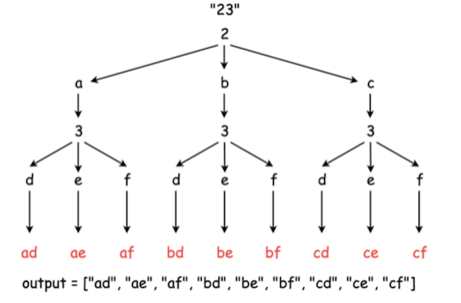

16. 3Sum Closest   --Medium

    Given an array `nums` of *n* integers and an integer `target`, find three integers in `nums` such that the sum is closest to `target`. Return the sum of the three integers. You may assume that each input would have exactly one solution.

     

    **Example 1:**

    ```
    Input: nums = [-1,2,1,-4], target = 1
    Output: 2
    Explanation: The sum that is closest to the target is 2. (-1 + 2 + 1 = 2). 
    ```

    **Constraints:**

    - `3 <= nums.length <= 10^3`
    - `-10^3 <= nums[i] <= 10^3`
    - `-10^4 <= target <= 10^4`

    **Solution:** similar with No.15(3sum), sort first, fix one and use two pointers. use one variable to record the cloest value.

    ```java
    public int threeSumClosest(int[] nums, int target) {
            Arrays.sort(nums);
            int min = 10000000;
            for (int i = 0; i < nums.length ; i++) {
                if (i > 0 && nums[i] == nums[i - 1]) {
                    continue;
                }
                int cur1 = i+1;
                int cur2 = nums.length-1;
                while (cur1<cur2){
                    int sum = nums[i]+nums[cur1]+nums[cur2];
                    if (sum == target) {
                        return target;
                    }
                    if (Math.abs(sum-target)<Math.abs(min-target))
                        min = sum;
                    if(sum<target)
                        cur1++;
                    else
                        cur2--;
                }
            }
            return min;
        }
    ```

17. Letter Combinations of a Phone Number    --Medium

    Given a string containing digits from `2-9` inclusive, return all possible letter combinations that the number could represent.

    A mapping of digit to letters (just like on the telephone buttons) is given below. Note that 1 does not map to any letters.

    

    **Example:**

    ```
    Input: "23"
    Output: ["ad", "ae", "af", "bd", "be", "bf", "cd", "ce", "cf"].
    ```

    **Note:**

    Although the above answer is in lexicographical order, your answer could be in any order you want.

    **Solutions:** The core idea is using recursion to realize DFS iteration process.

    

    17.1 use map and index to recurse

    ```java
    public static List<String> letterCombinations(String digits) {
            List<String> ls = new ArrayList<>();
            if(digits==null || digits.length() ==0)
                return ls;
            Map<String, String> map = new HashMap<>();
            map.put("2", "abc");
            map.put("3", "def");
            map.put("4", "ghi");
            map.put("5", "jkl");
            map.put("6", "mno");
            map.put("7", "pqrs");
            map.put("8", "tuv");
            map.put("9", "wxyz");
            StringBuilder sb = new StringBuilder();
            letterCombi(sb, digits, ls, map, 0);
            return ls;
        }
    
        public static void letterCombi(StringBuilder sb, String digits, List<String> ls, Map<String, String> map, int index) {
            if (index == digits.length()) {
                ls.add(sb.toString());
            } else {
                int len = map.get(String.valueOf(digits.charAt(index))).length();
                String k = map.get(String.valueOf(digits.charAt(index)));
                for (int i = 0; i < len; i++) {
                    sb.append(k.charAt(i));
                    letterCombi(sb, digits, ls, map, index + 1);
                    sb.deleteCharAt(index);
                }
            }
        }
    ```

    17.2 use string array and no index to recurse

    ```java
    static String[] phone = {"abc", "def", "ghi", "jkl", "mno", "pqrs", "tuv", "wxyz"};
    public static List<String> letterCombinations(String digits) {
            List<String> ls = new ArrayList<>();
            if(digits==null || digits.length() ==0)
                return ls;
            StringBuilder sb = new StringBuilder();
            letterCombi2(sb,digits,ls);
            return ls;
        }
    public static void letterCombi2(StringBuilder sb, String digits, List<String> ls) {
            if (digits.length()==0) {
                ls.add(sb.toString());
            } else {
                int index = digits.charAt(0)-'0';
                String s = phone[index-2];
                for (int i = 0; i <s.length() ; i++) {
                    sb.append(s.substring(i,i+1));
                    letterCombi2(sb,digits.substring(1),ls);
                    sb.deleteCharAt(sb.length()-1);
                }
            }
        }
    ```

    17.3 use string array and index to recurse

    ```java
    static String[] phone = {"abc", "def", "ghi", "jkl", "mno", "pqrs", "tuv", "wxyz"};
    public static List<String> letterCombinations(String digits) {
            List<String> ls = new ArrayList<>();
            if(digits==null || digits.length() ==0)
                return ls;
            StringBuilder sb = new StringBuilder();
            letterCombi3(sb,digits,ls,0);
            return ls;
        }
    public static void letterCombi3(StringBuilder sb, String digits, List<String> ls, int index) {
            if (index == digits.length()) {
                ls.add(sb.toString());
            } else {
                int len = phone[digits.charAt(index)-'2'].length();
                String k = phone[digits.charAt(index)-'2'];
                for (int i = 0; i < len; i++) {
                    sb.append(k.charAt(i));
                    letterCombi3(sb, digits, ls, index + 1);
                    sb.deleteCharAt(index);
                }
            }
        }
    ```

18. 4Sum   --Medium

    Given an array `nums` of *n* integers and an integer `target`, are there elements *a*, *b*, *c*, and *d* in `nums` such that *a* + *b* + *c* + *d* = `target`? Find all unique quadruplets in the array which gives the sum of `target`.

    **Note:**

    The solution set must not contain duplicate quadruplets.

    **Example:**

    ```
    Given array nums = [1, 0, -1, 0, -2, 2], and target = 0.
    
    A solution set is:
    [
      [-1,  0, 0, 1],
      [-2, -1, 1, 2],
      [-2,  0, 0, 2]
    ]
    ```

     **Solution:**

    ```java
    public static List<List<Integer>> fourSum(int[] nums, int target) {
            Set<List<Integer>> res = new LinkedHashSet<>();
            Arrays.sort(nums);
            int len = nums.length;
            for (int i = 0; i < len ; i++) {
                for (int j = i+1; j < len; j++){
                    int left = j+1; int right = len-1;
                    int tar = target-nums[i]-nums[j];
                    while(left<right){
                        if (nums[left]+nums[right]==tar){
                            List<Integer> list = Arrays.asList(nums[i],nums[j],nums[left],nums[right]);
                            res.add(list);
                            while (left<len && nums[left]==nums[left+1]) left++;  //skip repeat elements
                            while (right<len && nums[right] == nums[right-1]) right--; //skip repeat elements
                        } else if(nums[left]+nums[right]>tar)
                            right--;
                        else
                            left++;
                    }
                }
            }
            List<List<Integer>> ls = new ArrayList<>(res);
            return ls;
        }
    ```

    To decrese the runtime, we need to add some judgment conditions:

    ```java
    public static List<List<Integer>> fourSum(int[] nums, int target) {
            if(nums == null || nums.length < 4)
                      return results;
            Set<List<Integer>> res = new LinkedHashSet<>();
            Arrays.sort(nums);
            int len = nums.length;
            for (int i = 0; i < len ; i++) {
              	// determine if target is likely to be achieve
                if(i > 0 && nums[i] == nums[i-1])	continue;
                if(nums[i] * 4 > target)	break;
                if(nums[i] + 3 * nums[nums.length - 1] < target)	continue;
                for (int j = i+1; j < len; j++){
                  	// determine if target is likely to be achieve
                  	if(j > i + 1 && nums[j] == nums[j - 1])	continue;
                    if(nums[j] * 3 > target - nums[i])	break;
                    if(nums[j] + 2 * nums[nums.length - 1] < target - nums[i])	continue;
                    int left = j+1; int right = len-1;
                    int tar = target-nums[i]-nums[j];
                    while(left<right){
                        if (nums[left]+nums[right]==tar){
                            List<Integer> list = Arrays.asList(nums[i],nums[j],nums[left],nums[right]);
                            res.add(list);
                            while (left<len && nums[left]==nums[left+1]) left++;  //skip repeat elements
                            while (right<len && nums[right] == nums[right-1]) right--; //skip repeat elements
                        } else if(nums[left]+nums[right]>tar)
                            right--;
                        else
                            left++;
                    }
                }
            }
            List<List<Integer>> ls = new ArrayList<>(res);
            return ls;
        }
    ```

19. Remove Nth Node From End of List  --Medium

    Given a linked list, remove the *n*-th node from the end of list and return its head.

    **Example:**

    ```
    Given linked list: 1->2->3->4->5, and n = 2.
    
    After removing the second node from the end, the linked list becomes 1->2->3->5.
    ```

    **Note:**

    Given *n* will always be valid.

    **Follow up:**

    Could you do this in one pass?

    **Solutions:**

    19.1 loop twice

    ```java
    public ListNode removeNthFromEnd(ListNode head, int n) {
            ListNode dummy = new ListNode(0);
            dummy.next = head;
            int length  = 0;
            ListNode first = head;
            while (first != null) {
                length++;
                first = first.next;
            }
            length -= n;
            first = dummy;
            while (length > 0) {
                length--;
                first = first.next;
            }
            first.next = first.next.next;
            return dummy.next;
        }
    ```

    19.2 do in one pass: use fast and slow pointers

    ```java
    public static ListNode removeNthFromEnd3(ListNode head, int n) {
            ListNode dummy = new ListNode(0);
      			dummy.next = head;
            ListNode slow = dummy;
            ListNode fast = dummy;
            while (fast.next!=null && n-- > 0) {
                fast = fast.next;
            }
            while (fast.next != null) {
                fast = fast.next;
                slow = slow.next;
            }
            if (slow.next != null)
                slow.next = slow.next.next;
            return dummy.next;
        }
    ```

20. Valid Parentheses   --Easy

    Given a string containing just the characters `'('`, `')'`, `'{'`, `'}'`, `'['` and `']'`, determine if the input string is valid.

    An input string is valid if:

    1. Open brackets must be closed by the same type of brackets.
    2. Open brackets must be closed in the correct order.

    Note that an empty string is also considered valid.

    **Example 1:**

    ```
    Input: "()"
    Output: true
    ```

    **Example 2:**

    ```
    Input: "()[]{}"
    Output: true
    ```

    **Example 3:**

    ```
    Input: "(]"
    Output: false
    ```

    **Example 4:**

    ```
    Input: "([)]"
    Output: false
    ```

    **Example 5:**

    ```
    Input: "{[]}"
    Output: true
    ```

    **Solutions:**

    20.1 use stack to store brackets, each time we meet the closed brakets, we check if the top of the stack is the corresponding open brackets. If they matches, we pop the top of the stack. Otherwise, return false.

    ```java
    public boolean isValid(String s) {
            Stack<Character> st = new Stack<>();
            st.push('+');
            for (int i = 0; i < s.length() ; i++) {
                if(s.charAt(i)==')' && st.peek()=='(')
                    st.pop();
                else if(s.charAt(i)=='}' && st.peek() == '{')
                    st.pop();
                else if(s.charAt(i)==']' && st.peek() == '[')
                    st.pop();
                else
                    st.push(s.charAt(i));
            }
            if(st.peek()=='+')
                return true;
            else
                return false;
        }
    ```

    20.2 To simplify the following code. We can use HashMap to store corresponding brackets. Then we do not need to check by the different cases.

    ```java
    public boolean isValid(String s) {
            Map<Character,Character> map = new HashMap<>();
            map.put(')','(');
            map.put('}','{');
            map.put(']','[');
            map.put('+','+');
            Stack<Character> st = new Stack<>();
            st.push('+');
            for (int i = 0; i < s.length(); i++) {
                if(map.containsKey(s.charAt(i)) && st.peek()==map.get(s.charAt(i)))
                    st.pop();
                else
                    st.push(s.charAt(i));
            }
            return st.peek() == '+';
        }
    ```

    20.3 use an array instead of a stack to reduce the runtime. (use array to realize stack)

    ```java
    public boolean isValid(String s) {
            char[] stack = new char[s.length()];
            int head = 0;
    
            for (int i = 0, len = s.length(); i < len; i++) {
                char letter = s.charAt(i);
    
                switch (letter) {
                    case '(':
                        stack[head++] = ')';
                        continue;
                    case '{':
                        stack[head++] = '}';
                        continue;
                    case '[':
                        stack[head++] = ']';
                        continue;
                }
    						//when letter is not open brackets, check if the previous letter is the corresponding bracket
                //if not, return false
                //if the numbers of closed brakets equals to the open brackets before the string is traversed
              	//return false
                if (head == 0 || letter != stack[--head]) {
                    return false;
                }
            }
    
            return head == 0;
        }
    ```

    

    