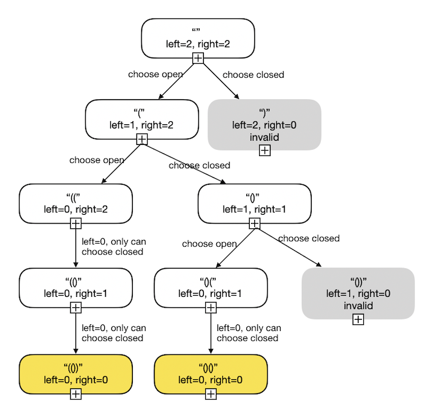

21. Merge Two Sorted Lists    --Easy

    Merge two sorted linked lists and return it as a new **sorted** list. The new list should be made by splicing together the nodes of the first two lists.

    **Example:**

    ```
    Input: 1->2->4, 1->3->4
    Output: 1->1->2->3->4->4
    ```

    **Solution:**

    21.1 Iteration

    ```java
    public ListNode mergeTwoLists(ListNode l1, ListNode l2) {
            ListNode prehead = new ListNode(-1);
    
            ListNode prev = prehead;
            while (l1 != null && l2 != null) {
                if (l1.val <= l2.val) {
                    prev.next = l1;
                    l1 = l1.next;
                } else {
                    prev.next = l2;
                    l2 = l2.next;
                }
                prev = prev.next;
            }
    
            // After merging l1 and L2, there is at most one list that has not been merged. 
      			// We can directly point the end of the result list to the list that has not been merged
            prev.next = l1 == null ? l2 : l1;
    
            return prehead.next;
        }
    ```

    21.2 Recursion

    ```java
    public ListNode mergeTwoLists(ListNode l1, ListNode l2) {
            if(l1==null)
                return l2;
            if(l2==null)
                return l1;
            if(l1.val<l2.val) {
                l1.next = mergeTwoLists(l1.next, l2);
                return l1;
            }else {
                l2.next = mergeTwoLists(l1, l2.next);
                return l2;
            }
        }
    ```

22. Generate Parentheses  --Medium

    Given *n* pairs of parentheses, write a function to generate all combinations of well-formed parentheses.

    For example, given *n* = 3, a solution set is:

    ```
    [
      "((()))",
      "(()())",
      "(())()",
      "()(())",
      "()()()"
    ]
    ```

    **Solutions:**

    22.1 Use the idea of DFS, variables left and right record the numbers of remaining parenthesis. If the left and right are greater than zero, we can still go down. If both the left and the right variables are equal to 0, then stop the iteration and return the result. Also, if left variable is bigger than right variable, which means using a close parentheses before a valid open parentheses.

    
    
    ```java
    public List<String> generateParenthesis(int n) {
            List<String> ls = new ArrayList<>();
            StringBuilder sb = new StringBuilder();
            parenthesisDFS(ls, sb, n, n);
            return ls;
        }
    
    public static void parenthesisDFS(List<String> ls, StringBuilder sb, int left, int right){
            if (left==0 && right==0) {
              ls.add(sb.toString());
              return;
            }
    
            if(left>0) {
              parenthesisDFS(ls, sb.append('('), left - 1, right);
              sb.deleteCharAt(sb.length()-1);
            }
    
            if (right>left) {
              parenthesisDFS(ls, sb.append(')'), left, right - 1);
              sb.deleteCharAt(sb.length()-1);
            }
		}
    ```
    
    22.2 Dynamic programming
    
    

23. Merge k Sorted Lists  --Hard

    Merge *k* sorted linked lists and return it as one sorted list. Analyze and describe its complexity.

    **Example:**

    ```
    Input:
    [
      1->4->5,
      1->3->4,
      2->6
    ]
    Output: 1->1->2->3->4->4->5->6
    ```

    **Solutions:**

    23.1 Use PriorityQueue to realize min heap.  --4ms

    ```java
    public static ListNode mergeKLists(ListNode[] lists) {
            if(lists.length ==0)
                return null;
            int len = lists.length;
            ListNode dummy = new ListNode(-1);
            ListNode dummy2 = dummy;
            PriorityQueue<ListNode> pq = new PriorityQueue<>((a,b)->(a.val-b.val));
            for (int i = 0; i < len; i++) {
                pq.add(lists[i]);
            }
            while (!pq.isEmpty()){
                ListNode node = pq.poll();
                dummy.next = node;
                dummy = dummy.next;
                if (node != null)
                    node = node.next;
            }
            return dummy2.next;
        }
    ```

    23.2 Use two merge function.  99ms

    ```java
    public static ListNode mergeTwoLists(ListNode l1, ListNode l2) {
            if(l1==null)
                return l2;
            if(l2==null)
                return l1;
            if(l1.val>l2.val)
                l2.next = mergeTwoLists(l1,l2.next);
            else
                l1.next = mergeTwoLists(l1.next,l2);
            return l1.val>l2.val?l2:l1;
        }
    
    public static ListNode mergeKLists(ListNode[] lists) {
            int len = lists.length;
            if(len==0)
                return null;
            ListNode res = lists[0];
            for (int i = 1; i < len; i++) {
                res = mergeTwoLists(res,lists[i]);
            }
            return res;
        }
    ```

    