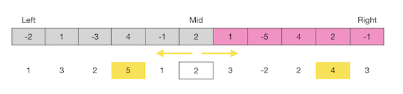

50. 


53. Maximum Subarray  --Easy

    Given an integer array `nums`, find the contiguous subarray (containing at least one number) which has the largest sum and return its sum.

    **Example:**

    ```
    Input: [-2,1,-3,4,-1,2,1,-5,4],
    Output: 6
    Explanation: [4,-1,2,1] has the largest sum = 6.
    ```

    **Follow up:**

    If you have figured out the O(*n*) solution, try coding another solution using the divide and conquer approach, which is more subtle

    **Solutions:**

    53.1 greedy  O(n)+O(1)

    ```java
    public static int maxSubArray(int[] nums) {
            int max = nums[0], sum = nums[0];
            for (int i = 1; i < nums.length; i++) {
                sum = Math.max(sum, sum + nums[i]);
                max = Math.max(max, sum);
            }
            return max;
        }
    ```

    53.2 dynamic programming  O(n)+O(n)

    ```java
    public static int maxSubArray(int[] nums) {
            int[] dp = new int[nums.length];
            dp[0] = nums[0];
            int max = nums[0];
            for (int i = 1; i < nums.length; i++) {
                dp[i] = Math.max(dp[i-1] + nums[i], nums[i]);
                max = Math.max(max, dp[i]);
            }
            return max;
        }
    ```

    53.3 divide and conquer: for the maximum subArray, there are three cases:

    		+ it is on the left part
    		+ it is on the right part
    		+ it it goes through the left and right part

    For every left and right parts, they can also be considered from three cases. Thus, we can use recursion to deal with. For the case that go through the middle, we can calculate the maximum sum from the middle element to left side and right side separately.

    

    ```java
    public static int maxSubArray4(int[] nums) {
            return maxSub(nums, 0, nums.length-1);
        }
    
        public static int maxSub(int[] nums, int left, int right){
            if (left==right)
                return nums[left];
            int mid = left+(right-left)/2;
            int leftMax = maxSub(nums, left, mid);
            int rightMax = maxSub(nums, mid+1, right);
            int leftSum = Integer.MIN_VALUE;
            int sum = 0;
            for (int i = mid; i >= left; i--)
            {
                sum += nums[i];
                leftSum = Math.max(leftSum, sum);
            }
            int rightSum = Integer.MIN_VALUE;
            sum = 0;
            for (int i = mid + 1; i <= right; i++)
            {
                sum += nums[i];
                rightSum = Math.max(rightSum, sum);
            }
            int midMax =  leftSum + rightSum;
            int result = Math.max(leftMax,rightMax);
            return Math.max(result,midMax);
        }
    ```


58. Length of Last Word   --Easy

    Given a string *s* consists of upper/lower-case alphabets and empty space characters `' '`, return the length of last word (last word means the last appearing word if we loop from left to right) in the string.

    If the last word does not exist, return 0.

    **Note:** A word is defined as a **maximal substring** consisting of non-space characters only.

    **Example:**

    ```
    Input: "Hello World"
    Output: 5
    ```

    **Solutions:**

    58.1 use split function

    ```java
    public static int lengthOfLastWord(String s) {
            String[] words = s.split(" ");
            if(words.length==0)
                return 0;
            return words[words.length-1].length();
        }
    ```

    58.2 use trim and traverse s

    ```java
    public static int lengthOfLastWord(String s) {
            s = s.trim();
            int end = s.length() - 1;
            while(end >= 0 && s.charAt(end) != ' ') end--;
            return s.length() - 1 - end;
        }
    ```