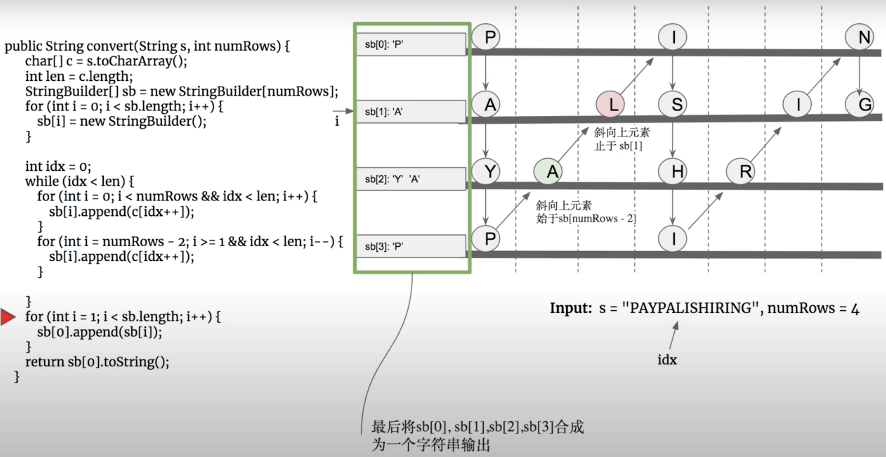
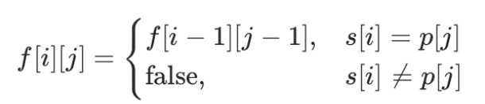
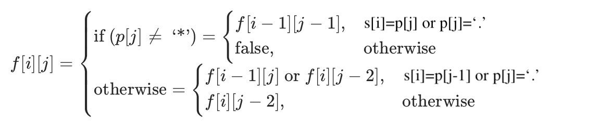

## 6-10

6. ZigZag Conversion  --Medium

   The string `"PAYPALISHIRING"` is written in a zigzag pattern on a given number of rows like this: (you may want to display this pattern in a fixed font for better legibility)

   ```
   P   A   H   N
   A P L S I I G
   Y   I   R
   ```

   And then read line by line: `"PAHNAPLSIIGYIR"`

   Write the code that will take a string and make this conversion given a number of rows:

   ```
   string convert(string s, int numRows);
   ```

   **Example 1:**

   ```
   Input: s = "PAYPALISHIRING", numRows = 3
   Output: "PAHNAPLSIIGYIR"
   ```

   **Example 2:**

   ```
   Input: s = "PAYPALISHIRING", numRows = 4
   Output: "PINALSIGYAHRPI"
   Explanation:
   
   P     I    N
   A   L S  I G
   Y A   H R
   P     I
   ```

   **Solution:**

   6.1 using several Stringbuilders to record different lines' String. And join them together in the end.  --4ms

   ```java
   public static String convert(String s, int numRows) {
           int len = s.length();
           char[] array = s.toCharArray();
           StringBuilder[] sb = new StringBuilder[numRows];
     			//for each sb, we need initialize it
           for(int i=0;i<numRows;i++){
               sb[i] = new StringBuilder();
           }
           int k=0;
           while(k<len) {
             // the k<len in the inner loop is less than len, which is very important
             // cause the outer loop while will not check k<len when in the inner loop
             // even k is already bigger than len, k will keep increasing in the inner loop
               for (int i = 0; i < numRows && k<len; i++) {  // add chars on the downward vertical line
                   sb[i].append(array[k++]);
               }
               for(int i=numRows-2; i>=1 && k<len; i--){ // add chars on the diagonal upward line
                   sb[i].append(array[k++]);
               }
           }
           for(int i=1; i<sb.length; i++){
               sb[0].append(sb[i]);
           }
           return sb[0].toString();
       }
   ```

   

   6.1.1 in the above code, two loops are used to represent a straight down and a diagonal up process seperately. we can also use a trick to instead.  --20ms

   ```java
   if(curRows==1) return s;
   boolean goDown = false;  //record the direction
   int curRow=0;
   for(char c : array){
       sb[curRow].append(c);
       if(curRow == 0 || curRow == numRows-1){
         	goDown = !goDown;
     }
     	curRow += goDown ? 1 : -1;
   }
   ```

   6.2 calculate the position rule for the index of each line characters. then use those index equation to add them to StringBuilders.                 --9ms

   ```java
   public static String convert(String s, int numRows) {
           if(numRows==1) return s;
           int len = s.length();
           char[] array = s.toCharArray();
           int cycleLen = 2*numRows-2;
           StringBuilder[] sb = new StringBuilder[numRows];
           for(int i=0; i<numRows; i++){
               sb[i] = new StringBuilder();
           }
     			// i represent the rows; j represent the value of increasing cycles
     			// for chars on the straight line, i represent the initial value for each position
     			// for chars on the diagonal line, cycleLen-i represent the initial value for each position
           for(int i=0; i<numRows; i++){
               for(int j=0; i+j<len; j+=cycleLen){  // add chars on the straight downward line 
                   sb[i].append(array[i+j]);
                   if(i!=0 && i!=numRows-1 && j+cycleLen-i<len){  // add chars on the diagonal upward line
                       sb[i].append(array[j + cycleLen - i]);
                   }
               }
           }
           StringBuilder ret = new StringBuilder();
           for(StringBuilder sbi : sb){
               ret.append(sbi);
           }
           return ret.toString();
       }
   ```

7. Reverse Integer  --Easy

   Given a 32-bit signed integer, reverse digits of an integer.

   **Example 1:**

   ```
   Input: 123
   Output: 321
   ```

   **Example 2:**

   ```
   Input: -123
   Output: -321
   ```

   **Example 3:**

   ```
   Input: 120
   Output: 21
   ```

   **Note:**
   Assume we are dealing with an environment which could only store integers within the 32-bit signed integer range: [−231, 231 − 1]. For the purpose of this problem, assume that your function returns 0 when the reversed integer overflows.

   **Solution:** 

   ```java
   public int reverse(int x) {
           int sum = 0;
           int last = 0;
           while(x!=0) {
               int tail = x % 10;
               x = x / 10;
               last = sum;
               sum = sum * 10 + tail;
               if ((sum-tail)/10 !=last) {    //if (sum * 10 + tail) overflows, return 0 
                   return 0;
               }
           }
           return ((x<0)?0-sum:sum);
       }
   ```

   8. String to Integer (atoi)  --Medium

    Implement `atoi` which converts a string to an integer.

   The function first discards as many whitespace characters as necessary until the first non-whitespace character is found. Then, starting from this character, takes an optional initial plus or minus sign followed by as many numerical digits as possible, and interprets them as a numerical value.

   The string can contain additional characters after those that form the integral number, which are ignored and have no effect on the behavior of this function.

   If the first sequence of non-whitespace characters in str is not a valid integral number, or if no such sequence exists because either str is empty or it contains only whitespace characters, no conversion is performed.

   If no valid conversion could be performed, a zero value is returned.

   **Note:**

   - Only the space character `' '` is considered as whitespace character.
   - Assume we are dealing with an environment which could only store integers within the 32-bit signed integer range: [−231, 231 − 1]. If the numerical value is out of the range of representable values, INT_MAX (231 − 1) or INT_MIN (−231) is returned.

   **Example 1:**

   ```
   Input: "42"
   Output: 42
   ```

   **Example 2:**

   ```
   Input: "   -42"
   Output: -42
   Explanation: The first non-whitespace character is '-', which is the minus sign.
                Then take as many numerical digits as possible, which gets 42.
   ```

   **Example 3:**

   ```
   Input: "4193 with words"
   Output: 4193
   Explanation: Conversion stops at digit '3' as the next character is not a numerical digit.
   ```

   **Example 4:**

   ```
   Input: "words and 987"
   Output: 0
   Explanation: The first non-whitespace character is 'w', which is not a numerical 
                digit or a +/- sign. Therefore no valid conversion could be performed.
   ```

   **Example 5:**

   ```
   Input: "-91283472332"
   Output: -2147483648
   Explanation: The number "-91283472332" is out of the range of a 32-bit signed integer.
                Thefore INT_MIN (−231) is returned.
   ```

   **Solution:**

   8.1 simple traversal method. The key point is checking out different conditions.

   ```java
   public static int myAtoi(String str) {
           int i=0, len = str.length(), sign=1, sum=0;
           while(i<len && str.charAt(i)==' ') i++;
           if(i==len) return 0;                      //smart method to skip space and deal eage cases 
           if(str.charAt(i)=='+' || str.charAt(i)=='-')
               sign = (str.charAt(i++)=='+')?1:-1;
           while(i<len && str.charAt(i)<='9' && str.charAt(i)>='0'){
               int digit = str.charAt(i)-'0';
               if(sign==1 && ((sum>Integer.MAX_VALUE/10) || (sum==Integer.MAX_VALUE/10 && digit > Integer.MAX_VALUE%10)))
                   return Integer.MAX_VALUE;
               if(sign==-1 && ((sum>-(Integer.MIN_VALUE/10)) || (sum==-(Integer.MIN_VALUE/10) && digit>(-(Integer.MIN_VALUE%10)))))
                   return Integer.MIN_VALUE;
               sum = sum*10 + digit;
               i++;
           }
           return sign*sum;
           }
   ```

   **reference：**

   https://leetcode-cn.com/problems/string-to-integer-atoi/solution/san-chong-fang-fa-zheng-chang-bian-li-you-xian-zhu/

   This problem can also be solved by using Finite-State Machine(FSM 有限状态机) and Regular Expression(正则表达式). Which are two very interesting and effective.

9. Palindrome Number   --Easy

   Determine whether an integer is a palindrome. An integer is a palindrome when it reads the same backward as forward.

   **Example 1:**

   ```
   Input: 121
   Output: true
   ```

   **Example 2:**

   ```
   Input: -121
   Output: false
   Explanation: From left to right, it reads -121. From right to left, it becomes 121-. Therefore it is not a palindrome.
   ```

   **Example 3:**

   ```
   Input: 10
   Output: false
   Explanation: Reads 01 from right to left. Therefore it is not a palindrome.
   ```

   **Follow up:**

   Coud you solve it without converting the integer to a string?

   **Solution:**

   9.1 If we convert the integer to a string, we can use some built-in functions to solve, like:

   ```java
   public static boolean isPalindrome(int x) {
           if(x<0)
               return false;
           StringBuilder sb = new StringBuilder(String.valueOf(x));
           return sb.toString().equals(sb.reverse().toString());
       }
   ```

   9.2 If we do not use StringBuilder's reverse function, we can reverse the integer to check if it is a palindrome. However, we need to consider the integer overflow question. To aviod that, we can just reverse half of the integer and check if it is same with the left part.

   ```java
   public static boolean isPalindrome(int x) {
           if(x<0 || (x%10==0) && x!=0)  // if the last digit is not 0, it's definitely not palindrome
               return false;
           int reverseX = 0;
           while(x>reverseX){
                reverseX = reverseX*10 + x%10;
                x /= 10;
           }
           return reverseX == x || reverseX/10 == x;    // the integer may be odd or even
       }
   ```

   9.3 comparing the leftmost and rightmost digit.

   ```java
   public static boolean isPalindrome(int x) {
            if(x<0 || (x!=0 && x%10 ==0))
                return false;
            int div=1;
            while(x/div>=10) div *= 10;
            while(x>0){
                int left = x/div;
                int right = x%10;
                if(left != right) return false;
                x = x%div/10;
                div /= 100;
            }
            return true;
       }
   ```

   9.4 if the input integer is a palindrome, when we reverse it, it will not cause integer overflow. Which means it cannot be palindrome.

   ```java
   public static boolean isPalindrome(int x) {
            if(x<0 || (x!=0 && x%10 ==0))
                return false;
            int orig = x, sum=0;
            while(x>0){
                if((sum>Integer.MAX_VALUE/10) || (sum==Integer.MAX_VALUE/10 && x%10 > Integer.MAX_VALUE%10))
                    return false;
                sum = sum*10 + x%10;
                x /= 10;
            }
            return sum==orig;
       }
   ```

10. Regular Expression Matching    --Hard

    Given an input string (`s`) and a pattern (`p`), implement regular expression matching with support for `'.'` and `'*'`.

    ```
    '.' Matches any single character.
    '*' Matches zero or more of the preceding element.
    ```

    The matching should cover the **entire** input string (not partial).

    **Note:**

    - `s` could be empty and contains only lowercase letters `a-z`.
    - `p` could be empty and contains only lowercase letters `a-z`, and characters like `.` or `*`.

    **Example 1:**

    ```
    Input:
    s = "aa"
    p = "a"
    Output: false
    Explanation: "a" does not match the entire string "aa".
    ```

    **Example 2:**

    ```
    Input:
    s = "aa"
    p = "a*"
    Output: true
    Explanation: '*' means zero or more of the preceding element, 'a'. Therefore, by repeating 'a' once, it becomes "aa".
    ```

    **Example 3:**

    ```
    Input:
    s = "ab"
    p = ".*"
    Output: true
    Explanation: ".*" means "zero or more (*) of any character (.)".
    ```

    **Example 4:**

    ```
    Input:
    s = "aab"
    p = "c*a*b"
    Output: true
    Explanation: c can be repeated 0 times, a can be repeated 1 time. Therefore, it matches "aab".
    ```

    **Example 5:**

    ```
    Input:
    s = "mississippi"
    p = "mis*is*p*."
    Output: false
    ```

    **Solution:**

    10.1 using dynamic programming to solve. dp&#91;i][j&#93; express whether s&#91;0...i] and p&#91;0...j] can be matched. If they can, dp&#91;i][j&#93; is true, otherwise, it is false. 

    10.1.1 Analysis: 

    10.1.1.1 If p[j] is a lowercase letter, then if s[i] = p[j&#93;, dp&#91;i&#93;[j] = dp[i-1]&#91;j-1], else dp[i]&#91;j] = false.  

    

    10.1.1.2 If p[j] is character '.', then it can match any lowercase letter in string s. Therefore, dp&#91;i&#93;[j] = dp[i-1]&#91;j-1].

    10.1.1.3 If p[j] digit is character '*', then we can use p[j-1] character to match 0 to any times.

       - If we use p[j-1] character to match 0 times: dp&#91;i&#93;[j] = dp&#91;i&#93;[j-2]
       - If we use p[j-1] match more than 0 times. 
            - If p[j-1] digit is '.' or p[j-1] = s[i], then dp&#91;i&#93;[j] = dp&#91;i-1&#93;[j]
            - If p[j-1] != s[i], then dp&#91;i&#93;[j] = dp&#91;i&#93;[j-2]
       - Combine this two condition, just use || to add dp&#91;i&#93;[j-2]

    10.1.2 Final transtion equations:

    

    ```java
    public boolean isMatch(String s, String p) {
            int len1 = s.length(), len2 = p.length();
            boolean dp[][] = new boolean[len1+1][len2+1];
            dp[0][0] = true;
            for(int k=1; k<len2+1; k++){   //initialize
                if(p.charAt(k-1)=='*')
                    dp[0][k]=dp[0][k-2];
                else
                    dp[0][k]=false;
            }
            for(int i=1; i<len1+1; i++){
                for(int j=1; j<len2+1; j++){
                    if(p.charAt(j-1)=='*'){
                        if(p.charAt(j-2)==s.charAt(i-1) || p.charAt(j-2) == '.')
                            dp[i][j] = dp[i][j-2] || dp[i-1][j];
                        else
                            dp[i][j] = dp[i][j-2];
                    }else if(p.charAt(j-1)=='.'){
                        dp[i][j] = dp[i-1][j-1];
                    }else{
                        if(p.charAt(j-1)==s.charAt(i-1))
                            dp[i][j] = dp[i-1][j-1];
                        else
                            dp[i][j] = false;
                    }
                }
            }
        return dp[len1][len2];
        }
    ```

    10.2 we can use Recursion to solve. This method is difficult to think about and understand. Also, it is 12 times slower than DP.

    ```java
    public boolean isMatch(String s, String p) {
            if (p.isEmpty()) return s.isEmpty();
            if (p.length() == 1) 
                return (s.length() == 1 && (s.charAt(0) == p.charAt(0) || p.charAt(0) == '.'));
            if (p.charAt(1) != '*') {
                if (s.isEmpty()) return false;
                return (s.charAt(0) == p.charAt(0) || p.charAt(0) == '.') && isMatch(s.substring(1), p.substring(1));
            }
            while (!s.isEmpty() && (s.charAt(0) == p.charAt(0) || p.charAt(0) == '.')) {
                if (isMatch(s, p.substring(2))) return true;
                s = s.substring(1);
            }
            return isMatch(s, p.substring(2));
    
        }
    ```

    ```java
    public boolean isMatch(String s, String p) {
            if (p.isEmpty()) return s.isEmpty();
            if (p.length() > 1 && p.charAt(1) == '*') {
                return isMatch(s, p.substring(2)) || (!s.isEmpty() && (s.charAt(0) == p.charAt(0) || p.charAt(0) == '.') && isMatch(s.substring(1), p));
            } else {
                return !s.isEmpty() && (s.charAt(0) == p.charAt(0) || p.charAt(0) == '.') && isMatch(s.substring(1), p.substring(1));
            }
        }
    ```

    

       