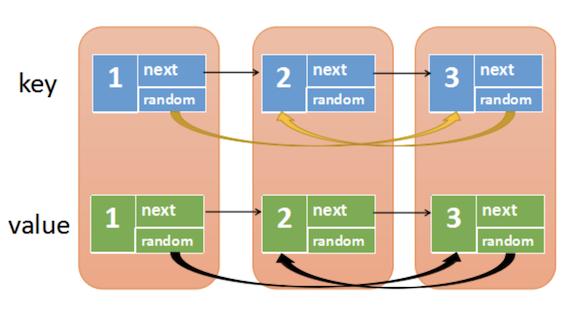

101. Symmetric Tree  --Easy

     Given a binary tree, check whether it is a mirror of itself (ie, symmetric around its center).

     For example, this binary tree `[1,2,2,3,4,4,3]` is symmetric:

     ```
         1
        / \
       2   2
      / \ / \
     3  4 4  3
     ```

     But the following `[1,2,2,null,3,null,3]` is not:

     ```
         1
        / \
       2   2
        \   \
        3    3 
     ```

     **Follow up:** Solve it both recursively and iteratively.

     **Solutions:**

     101.1 Recursion

     ```java
     public static boolean isSymmetric(TreeNode root) {
             if (root==null)
                 return true;
             return isSymmetric2(root.left,root.right);
         }
     
         public static boolean isSymmetric(TreeNode root1, TreeNode root2) {
             if (root1==null) return (root2==null);
             if (root2 == null) return false;
             return root1.val == root2.val && isSymmetric2(root1.left,root2.right) && isSymmetric2(root1.right,root2.left);
         }
     ```

     101.2 Iteration(can use both queue and stack). queue is faster 1 ms than stack.

     ```java
     public static boolean isSymmetric3(TreeNode root) {
             if (root==null)return true;
     //        Queue<TreeNode> q = new LinkedList<>();
             Stack<TreeNode> q = new Stack<>();
             q.add(root.left);
             q.add(root.right);
             while (!q.isEmpty()){
                 TreeNode node1 = q.pop();
                 TreeNode node2 = q.pop();
                 if (node1==null && node2==null)
                     continue;
                 if (node1==null || node2==null || node1.val != node2.val)
                     return false;
                 q.add(node1.left);
                 q.add(node2.right);
                 q.add(node1.right);
                 q.add(node2.left);
             }
             return true;
         }
     ```


102. Binary Tree Level Order Traversal   --Medium

     Given a binary tree, return the *level order* traversal of its nodes' values. (ie, from left to right, level by level).

     For example:
     Given binary tree `[3,9,20,null,null,15,7]`,

     ```
         3
        / \
       9  20
         /  \
        15   7
     ```

     return its level order traversal as:

     ```
     [
       [3],
       [9,20],
       [15,7]
     ]
     ```

     **Solutions:**

     102.1 BFS

     ```java
     public List<List<Integer>> levelOrder(TreeNode root) {
             List<List<Integer>> res = new ArrayList<>();
             Queue<TreeNode> q = new LinkedList<>();
             if (root == null)
                 return res;
             q.add(root);
             while (!q.isEmpty()) {
                 int n = q.size();
                 List<Integer> ls = new ArrayList<>();
                 for (int i = 0; i < n; i++) {
                     TreeNode node = q.poll();
                     ls.add(node.val);
                     if (node.left != null) q.offer(node.left);
                     if (node.right != null) q.offer((node.right));
                 }
                 res.add(ls);
             }
             return res;
         }
     ```

     102.2 DFS

     ```java
     public List<List<Integer>> levelOrder(TreeNode root) {
         List<List<Integer>> ans = new ArrayList<>(); 
         DFS(root, 0, ans);
         return ans;
     }
     
     private void DFS(TreeNode root, int level, List<List<Integer>> ans) {
         if(root == null){
             return;
         }
         //current level does not have elements, new a List
         if(ans.size()<=level){
             ans.add(new ArrayList<>());
         }
         //add current element into current level's List
         ans.get(level).add(root.val);
     
         DFS(root.left,level+1,ans);
         DFS(root.right,level+1,ans);
     }
     ```

     


104. Maximum Depth of Binary Tree   --Easy

     Given a binary tree, find its maximum depth.

     The maximum depth is the number of nodes along the longest path from the root node down to the farthest leaf node.

     **Note:** A leaf is a node with no children.

     **Example:**

     Given binary tree `[3,9,20,null,null,15,7]`,

     ```
         3
        / \
       9  20
         /  \
        15   7
     ```

     return its depth = 3.

     **Solution:**

     ```java
     public int maxDepth(TreeNode root) {
             if (root==null)
                 return 0;
             return 1 + Math.max(maxDepth(root.left),maxDepth(root.right));
         }
     ```


107. Binary Tree Level Order Traversal II  --Easy

     Given a binary tree, return the *bottom-up level order* traversal of its nodes' values. (ie, from left to right, level by level from leaf to root).

     For example:
     Given binary tree `[3,9,20,null,null,15,7]`,

     ```
         3
        / \
       9  20
         /  \
        15   7
     ```

     return its bottom-up level order traversal as:

     ```
     [
       [15,7],
       [9,20],
       [3]
     ]
     ```

     **Solutions:**

     BFS

     ```java
     public static List<List<Integer>> levelOrderBottom(TreeNode root) {
             Queue<TreeNode> q = new LinkedList<>();
             List<List<Integer>> res = new LinkedList<>();
             if (root==null) return res;
             q.add(root);
             while (!q.isEmpty()){
                 List<Integer> ls = new LinkedList<>();
                 int n = q.size();
                 for (int i = 0; i < n; i++) {
                     TreeNode node = q.poll();
                     ls.add(node.val);
                     if (node.left!=null)
                         q.add(node.left);
                     if (node.right!=null)
                         q.add(node.right);
                 }
                 res.add(0,ls);
             }
             return res;
         }
     ```

     DFS

     ```java
     public static List<List<Integer>> levelOrderBottom(TreeNode root) {
             LinkedList<List<Integer>> res = new LinkedList<>();
             dfs(res,root,0);
             return res;
         }
     
     public static void dfs(LinkedList<List<Integer>> res, TreeNode root, int level){
             if (root==null)
               return;
             if (res.size()<=level)
               res.addFirst(new ArrayList<>());
             res.get(res.size()-1-level).add(root.val);
     
             dfs(res, root.left, level+1);
             dfs(res, root.right, level+1);
     }
     ```

     

108. Convert Sorted Array to Binary Search Tree   --Easy

     Given an array where elements are sorted in ascending order, convert it to a height balanced BST.

     For this problem, a height-balanced binary tree is defined as a binary tree in which the depth of the two subtrees of *every* node never differ by more than 1.

     **Example:**

     ```
     Given the sorted array: [-10,-3,0,5,9],
     
     One possible answer is: [0,-3,9,-10,null,5], which represents the following height balanced BST:
     
           0
          / \
        -3   9
        /   /
      -10  5
     ```

     **Solution:** The most important thing is understanding the relation between sorted array and binary search tree. Binary search tree is a tree for each node, the left node's value is always less than or euqal to right node's value. In order to convert the sorted array to a height balanced BST, we can choose the middle num to be the middle root every time. Becasue, when we choose one num to be the root, than the left tree's elements are the left part of the array. The right tree's elements are the right part of the array. If we choose the middle one, then we can always control the diffrence between the left and right subtrees is less than or euqal to 1.

     ```java
     public TreeNode sortedArrayToBST(int[] nums) {
             return helper(nums,0,nums.length-1);
     }
     
     public TreeNode helper(int[] nums, int left, int right) {
             if (left>right) return null;
             int mid = left + (right-left)/2;
             TreeNode node = new TreeNode(nums[mid]);
             node.left = helper(nums,left,mid-1);
             node.right = helper(nums,mid+1,right);
             return node;
     }
     ```

109. Convert Sorted List to Binary Search Tree  --Medium

     Given a singly linked list where elements are sorted in ascending order, convert it to a height balanced BST.

     For this problem, a height-balanced binary tree is defined as a binary tree in which the depth of the two subtrees of *every* node never differ by more than 1.

     **Example:**

     ```
     Given the sorted linked list: [-10,-3,0,5,9],
     
     One possible answer is: [0,-3,9,-10,null,5], which represents the following height balanced BST:
     
           0
          / \
        -3   9
        /   /
      -10  5
     ```

     **Solutions:** 

     109.1 The same idea of 108. To find the middle element of a linked list, we can use fast and slow pointer. O(Nlog*N*)+O(log*N*)

     109.1.1 use one pre pointer to record the previous element of the middle one.

     ```java
     public static TreeNode sortedListToBST(ListNode head) {
             if (head == null)
                 return null;
             if (head.next == null)
                 return new TreeNode(head.val);
             ListNode slow = head;
             ListNode fast = head;
             ListNode dummy = new ListNode(-1);
             dummy.next = slow;
             while (fast!=null && fast.next!=null){
                 slow = slow.next;
                 dummy = dummy.next;
                 fast = fast.next.next;
             }
             TreeNode node = new TreeNode(slow.val);
             dummy.next = null;
             node.left = sortedListToBST(head);
             node.right = sortedListToBST(slow.next);
             return node;
         }
     ```

     109.1.2 use tail pointer and head pointer to indicate the range of current list.

     ```java
     public static TreeNode sortedListToBST(ListNode head) {
             ListNode tail = head;
             while (tail.next!=null)
                 tail = tail.next;
             return dfs(head,tail);
         }
     
         public static TreeNode dfs(ListNode head, ListNode tail){
             if (head==tail)
                 return null;
             ListNode slow = head;
             ListNode fast = head;
             while (fast!=null && fast.next!=null){
                 slow = slow.next;
                 fast = fast.next.next;
             }
             TreeNode node = new TreeNode(slow.val);
             node.left = dfs(head,slow);
             node.right = dfs(slow.next,tail);
             return node;
         }
     ```

     109.2 convert this linked list into an array then solve it as problem 108. O(N)+ O(N)

110. Balanced Binary Tree  --Easy

     Given a binary tree, determine if it is height-balanced.

     For this problem, a height-balanced binary tree is defined as:

     > a binary tree in which the left and right subtrees of *every* node differ in height by no more than 1.

     **Example 1:**

     Given the following tree `[3,9,20,null,null,15,7]`:

     ```
         3
        / \
       9  20
         /  \
        15   7
     ```

     Return true.

     **Example 2:**

     Given the following tree `[1,2,2,3,3,null,null,4,4]`:

     ```
            1
           / \
          2   2
         / \
        3   3
       / \
      4   4
     ```

     Return false.

     **Solutions:** 

     110.1 Use a local variable to record the status. once there is a node whose left and right subtrees differ in height by more than 1, label flag as 0. At the end, if flag is equal to 0, return false, otherwise return true.

     ```java
     class Solution {
         static int flag;
         public Solution(){
             this.flag=1;
         }
         public boolean isBalanced(TreeNode root) {
             int res = helper(root);
             if(flag==0)
                 return false;
             return true;
         }
         
         public static int helper(TreeNode root){
             if(root == null)
                 return 0;
             int left = helper(root.left);
             int right = helper(root.right);
             if(Math.abs(left-right)>1)
                 flag=0;
             return Math.max(left,right)+1;
         }
     }
     ```

     110.2 use the return value of helper function to determine whether it is a balanced binary tree.

     ```java
     class Solution {
         public boolean isBalanced(TreeNode root) {
             return helper(root)>=0;
         }
         
         public static int helper(TreeNode root){
             if(root == null)
                 return 0;
             int left = helper(root.left);
             int right = helper(root.right);
             if(left==-1 || right==-1 || Math.abs(left-right)>1)
                 return -1;
             return Math.max(left,right)+1;
         }
     }
     ```

     

111. Minimum Depth of Binary Tree  --Easy

     Given a binary tree, find its minimum depth.

     The minimum depth is the number of nodes along the shortest path from the root node down to the nearest leaf node.

     **Note:** A leaf is a node with no children.

     **Example:**

     Given binary tree `[3,9,20,null,null,15,7]`,

     ```
         3
        / \
       9  20
         /  \
        15   7
     ```

     return its minimum depth = 2.

     **Solutions:**

     111.1 use the idea of dfs

     ```java
     public int minDepth(TreeNode root) {
             if(root==null)
                 return 0;
             int left = minDepth(root.left)+1;
             int right = minDepth(root.right)+1;
             if(left==1)
                 return right;
             if(right==1)
                 return left;
             return Math.min(left, right);
         }
     ```

     111.2 use the idea of bfs

     ```java
     public int minDepth(TreeNode root) {
             if(root==null)
                 return 0;
             Queue<TreeNode> q = new LinkedList<>();
             int num = 1;
             q.add(root);
             while(!q.isEmpty()){
                 int n = q.size();
                 for(int i=0; i<n; i++){
                     TreeNode node = q.poll();
                     if(node.left==null && node.right==null)
                         return num;
                     if(node.left!=null)
                         q.add(node.left);
                     if(node.right!=null)
                         q.add(node.right);
                 }
                 num++;
             }
             return num;
         }
     ```

112. Path Sum  --Easy

     Given a binary tree and a sum, determine if the tree has a root-to-leaf path such that adding up all the values along the path equals the given sum.

     **Note:** A leaf is a node with no children.

     **Example:**

     Given the below binary tree and `sum = 22`,

     ```
           5
          / \
         4   8
        /   / \
       11  13  4
      /  \      \
     7    2      1
     ```

     return true, as there exist a root-to-leaf path `5->4->11->2` which sum is 22.

     **Solutions:**

     112.1 bfs

     ```java
     public boolean hasPathSum(TreeNode root, int sum) {
             if(root==null)
                 return false;
             if(root.val==sum && root.left==null && root.right==null)
                 return true;
             boolean left = hasPathSum(root.left, sum-root.val);
             boolean right = hasPathSum(root.right, sum-root.val);
             return left || right;
         }
     ```

     112.2 bfs

     ```java
     public boolean hasPathSum(TreeNode root, int sum) {
             if(root==null)
            return false;
             Queue<TreeNode> nodeq = new LinkedList<>();
             Queue<Integer> valq = new LinkedList<>();
             nodeq.add(root);
             valq.add(root.val);
             while(!nodeq.isEmpty()){
                 int n = nodeq.size();
                 for(int i=0; i<n; i++){
                     TreeNode node = nodeq.poll();
                     int val = valq.poll();
                     if(node.left==null && node.right==null){
                         if(val == sum)
                             return true;
                         else 
                             continue;
                     }
                     TreeNode left = node.left;
                     if(left!=null){
                         nodeq.add(left);
                         valq.add(val+left.val);
                     }
                     TreeNode right = node.right;
                     if(right!=null){
                         nodeq.add(right);
                         valq.add(val+right.val);
                     }
                 }
             }
             return false;
         }
     ```
     
113. Path Sum II   --Medium

     Given a binary tree and a sum, find all root-to-leaf paths where each path's sum equals the given sum.

     **Note:** A leaf is a node with no children.

     **Example:**

     Given the below binary tree and `sum = 22`,

     ```
           5
          / \
         4   8
        /   / \
       11  13  4
      /  \    / \
     7    2  5   1
     ```

     Return:

     ```
     [
        [5,4,11,2],
        [5,8,4,5]
     ]
     ```

     **Solution:** dfs, use one list to record each path, if current path meet the requirenment, add this path list to the result list, if not, remove the last element in the list.

     ```java
     class Solution {
         public List<List<Integer>> pathSum(TreeNode root, int sum) {
             List<List<Integer>> res = new ArrayList<>();
             LinkedList<Integer> ls = new LinkedList<>();
             helper(root,sum,res,ls);
             return res;
         }
     
         public static void helper(TreeNode root, int sum, List<List<Integer>> res, LinkedList<Integer> ls){
             if (root==null)
                 return;
             ls.addLast(root.val);
             if (root.left==null && root.right ==null && root.val == sum)
                 res.add(new ArrayList<>(ls));
     
             helper(root.left,sum-root.val,res,ls);
             helper(root.right,sum-root.val,res,ls);
             ls.removeLast();
         }
     }
     ```

     


118. Pascal's Triangle  --Easy

     Given a non-negative integer *numRows*, generate the first *numRows* of Pascal's triangle.

     

     **Example:**

     ```
     Input: 5
     Output:
     [
          [1],
         [1,1],
        [1,2,1],
       [1,3,3,1],
      [1,4,6,4,1]
     ]
     ```

     **Solution:**

     ```java
     List<List<Integer>> res = new ArrayList<>();
             if (numRows==0)
                 return res;
             List<Integer> ls1 = new ArrayList<>();
             ls1.add(1);
             res.add(ls1);
             for (int i = 1; i < numRows; i++) {
                 List<Integer> last = res.get(i-1);
                 List<Integer> ls = new ArrayList<>();
                 ls.add(1);
                 for (int j = 0; j < i-1; j++) {
                     int sum = last.get(j) + last.get(j+1);
                     ls.add(sum);
                 }
                 ls.add(1);
                 res.add(ls);
             }
             return res;
     ```

119. Pascal's Triangle II   --Easy

     Given an integer `rowIndex`, return the `rowIndexth` row of the Pascal's triangle.

     Notice that the row index starts from **0**.

     

     **Follow up:**

     Could you optimize your algorithm to use only *O*(*k*) extra space?

     **Example 1:**

     ```
     Input: rowIndex = 3
     Output: [1,3,3,1]
     ```

     **Example 2:**

     ```
     Input: rowIndex = 0
     Output: [1]
     ```

     **Example 3:**

     ```
     Input: rowIndex = 1
     Output: [1,1]
     ```

     **Constraints:**

     - `0 <= rowIndex <= 40`

     **Solutions:**

     119.1 use two list, one record the last row, one to calculate the current row.

     ```java
     public static List<Integer> getRow(int rowIndex) {
             List<Integer> pre = new ArrayList<>();
             List<Integer> cur = new ArrayList<>();
             pre.add(1);
             for(int i=1; i<=rowIndex; i++){
                 cur.clear();
                 cur.add(1);
                 for(int j=0; j<i-1; j++){
                     cur.add(pre.get(j)+pre.get(j+1));
                 }
                 cur.add(1);
                 pre.clear();
                 pre.addAll(cur);
             }
             return cur;
         }
     ```

     119.2 just use one list, use one variable to record the replaced integer.

     ```java
     public static List<Integer> getRow(int rowIndex) {
             List<Integer> result = new ArrayList<>(rowIndex + 1);
             result.add(1);
     
             for (int i = 1; i <= rowIndex; i++){
                 int pre = 1;
                 for (int j = 1; j < i; j++){
                     int temp = result.get(j);
                     result.set(j, temp + pre);
                     pre = temp;
                 }
                 result.add(1);
             }
             return result;
         }
     ```

     119.3 use one array, convert it to list at the end. Because the return type is a List<Integer>, the array must be Integer type too. Also, Integer array's default value is null. Thus we need to initialize each value of this array to 0.

     ```java
     public static List<Integer> getRow(int rowIndex) {
             Integer[] res = new Integer[rowIndex+1];
             Arrays.fill(res,0);
             res[0] = 1;
             for (int i = 1; i < rowIndex+1; i++) {
                 int pre = 1;
                 for (int j = 1; j < i; j++) {
                     int digit = res[j];
                     res[j] = digit+pre;
                     pre = digit;
                 }
                 res[i] = 1;
             }
             return Arrays.asList(res);
         }
     ```

     119.4 use one array, but calculate the current row backwards.

     ```java
     public static List<Integer> getRow(int rowIndex) {
             Integer[] res = new Integer[rowIndex+1];
             Arrays.fill(res,0);
             res[0] = 1;
             for (int i = 1; i <= rowIndex; i++) {
                 for (int j = i; j >= 0 ; j--) {
                     res[j] = res[j-1]+res[j];
                 }
             }
             return Arrays.asList(res);
         }
     ```


121. Best Time to Buy and Sell Stock  --Easy

     Say you have an array for which the *i*th element is the price of a given stock on day *i*.

     If you were only permitted to complete at most one transaction (i.e., buy one and sell one share of the stock), design an algorithm to find the maximum profit.

     Note that you cannot sell a stock before you buy one.

     **Example 1:**

     ```
     Input: [7,1,5,3,6,4]
     Output: 5
     Explanation: Buy on day 2 (price = 1) and sell on day 5 (price = 6), profit = 6-1 = 5.
                  Not 7-1 = 6, as selling price needs to be larger than buying price.
     ```

     **Example 2:**

     ```
     Input: [7,6,4,3,1]
     Output: 0
     Explanation: In this case, no transaction is done, i.e. max profit = 0.
     ```

     **Solution:**

     ```java
     public int maxProfit(int[] prices) {
             if(prices.length==0 || prices.length==1)
                 return 0;
             int n = prices.length;
             int max = 0, min=Integer.MAX_VALUE;
             for (int price : prices) {
                 if (price < min)
                     min = price;
                 else if (price - min > max)
                     max = price - min;
             }
             return max;
         }
     ```

     

122. Best Time to Buy and Sell Stock II  --Easy

     Say you have an array `prices` for which the *i*th element is the price of a given stock on day *i*.

     Design an algorithm to find the maximum profit. You may complete as many transactions as you like (i.e., buy one and sell one share of the stock multiple times).

     **Note:** You may not engage in multiple transactions at the same time (i.e., you must sell the stock before you buy again).

     **Example 1:**

     ```
     Input: [7,1,5,3,6,4]
     Output: 7
     Explanation: Buy on day 2 (price = 1) and sell on day 3 (price = 5), profit = 5-1 = 4.
                  Then buy on day 4 (price = 3) and sell on day 5 (price = 6), profit = 6-3 = 3.
     ```

     **Example 2:**

     ```
     Input: [1,2,3,4,5]
     Output: 4
     Explanation: Buy on day 1 (price = 1) and sell on day 5 (price = 5), profit = 5-1 = 4.
                  Note that you cannot buy on day 1, buy on day 2 and sell them later, as you are
                  engaging multiple transactions at the same time. You must sell before buying again.
     ```

     **Example 3:**

     ```
     Input: [7,6,4,3,1]
     Output: 0
     Explanation: In this case, no transaction is done, i.e. max profit = 0. 
     ```

     **Constraints:**

     - `1 <= prices.length <= 3 * 10 ^ 4`
     - `0 <= prices[i] <= 10 ^ 4`
     
     **Solutions:**
     
     122.1 calculate each (peak-valley)
     
     ```java
     public int maxProfit(int[] prices) {
             int n = prices.length;
             if(n==0 || n==1)
                 return 0;
             int min = prices[0], sum = 0;
             for(int i=0; i<n-1; i++){
                 if(prices[i+1]<prices[i]){
                     sum += prices[i]-min;
                     min = prices[i+1];
                 }
                 else if(i==n-2){
                     sum += prices[i+1]-min;
                     break;
                 }else
                     continue;
             }
             return sum;
         }
     ```
     
     122.2 calculate each point's profit comparing to last point (if larger
     
     
     
     ```java
     public int maxProfit(int[] prices) {
             int sum = 0;
             for (int i=0; i<prices.length-1; i++){
                 if (prices[i+1]>prices[i])
                     sum += prices[i+1] - prices[i];
             }
             return sum;
         }
     ```
     
     


125. Valid Palindrome  --Easy

     Given a string, determine if it is a palindrome, considering only alphanumeric characters and ignoring cases.

     **Note:** For the purpose of this problem, we define empty string as valid palindrome.

     **Example 1:**

     ```
     Input: "A man, a plan, a canal: Panama"
     Output: true
     ```

     **Example 2:**

     ```
     Input: "race a car"
     Output: false
     ```

     **Constraints:**

     - `s` consists only of printable ASCII characters.

     **Solutions:**

     125.1 remove all characters which is not digit or letter than determine

     ```java
     public boolean isPalindrome(String s) {
             StringBuilder sb = new StringBuilder();
             for (char c: s.toCharArray()){
                 if(Character.isLetterOrDigit(c))
                     sb.append(Character.toLowerCase(c)); // toLowerCase() to avoid case problem
             }
             StringBuilder rev = new StringBuilder(sb).reverse();  // can't: rev = sb.reverse()
             return sb.toString().equals(rev.toString());  // StringBuilder doesn't have equal()
         }
     ```

     125.2 do not use extra space, compare in the original string

     ```java
     public boolean isPalindrome(String s) {
             int n = s.length();
             char[] arr = s.toCharArray();
             int left = 0;
             int right = n-1;
             while (left<right){
                 while (left<=n-1 && !Character.isLetterOrDigit(arr[left]))
                     left++;
                 while (right>=0 && !Character.isLetterOrDigit(arr[right]))
                     right--;
                 if (left<right){
                     if (Character.toLowerCase(arr[left]) != Character.toLowerCase(arr[right]))
                         return false;
                     left++;
                     right--;
                 }
             }
             return true;
         }
     ```

     


136. Single Number  --Easy

     Given a **non-empty** array of integers, every element appears *twice* except for one. Find that single one.

     **Note:**

     Your algorithm should have a linear runtime complexity. Could you implement it without using extra memory?

     **Example 1:**

     ```
     Input: [2,2,1]
     Output: 1
     ```

     **Example 2:**

     ```
     Input: [4,1,2,1,2]
     Output: 4
     ```

     **Solutions:**

     136.1 we can use a hashset to store all the integers. and if we find there is already a same value in the set, we can remove it from the set. at the end, the last one left was the integer we want. O(n) +O((n))

     ```java
     public int singleNumber(int[] nums) {
             Set<Integer> set = new HashSet<>();
             for (int i : nums){
                 if (set.contains(i))
                     set.remove(i);
                 else
                     set.add(i);
             }
             return set.iterator().next();
         }
     ```

     136.2 use a hashmap to record the frequency of each node, and iterate the hashmap to find the integer whose value is 1. O(n)+O(n)

     136.3 use math method. calculate all the sum of the integers in array. and calculate the sub of all distinct integers. distract the sum of array from twice of sum of distinct numbers.

     ```java
     public int singleNumber3(int[] nums) {
             int sum = 0, sumOfSet = 0;
             Set<Integer> set = new HashSet<>();
             for(int i:nums){
                 if (!set.contains(i)) {
                     set.add(i);
                     sumOfSet += i;
                 }
                 sum+=i;
             }
             return sumOfSet*2-sum;
         }
     ```

     136.4 Bit Manipulation

     - If we take XOR of zero and some bit, it will return that bit
       - a⊕0=a*a*⊕0=*a*
     - If we take XOR of two same bits, it will return 0
       - a⊕a=0*a*⊕*a*=0
     - a⊕b⊕a=(a⊕a)⊕b=0⊕b=b*a*⊕*b*⊕*a*=(*a*⊕*a*)⊕*b*=0⊕*b*=*b*

     So we can XOR all bits together to find the unique number. 

     ```java
     public int singleNumber4(int[] nums) {
             int sum = 0;
             for (int i = 0; i < nums.length; i++) {
                 sum ^= nums[i];
             }
             return sum;
         }
     ```

     


138. Copy List with Random Pointer  --Medium

     A linked list is given such that each node contains an additional random pointer which could point to any node in the list or null.

     Return a [**deep copy**](https://en.wikipedia.org/wiki/Object_copying#Deep_copy) of the list.

     The Linked List is represented in the input/output as a list of `n` nodes. Each node is represented as a pair of `[val, random_index]` where:

     - `val`: an integer representing `Node.val`
     - `random_index`: the index of the node (range from `0` to `n-1`) where random pointer points to, or `null` if it does not point to any node. 

     **Example 1:**

     

     ```
     Input: head = [[7,null],[13,0],[11,4],[10,2],[1,0]]
     Output: [[7,null],[13,0],[11,4],[10,2],[1,0]]
     ```

     **Example 2:**

     

     ```
     Input: head = [[1,1],[2,1]]
     Output: [[1,1],[2,1]]
     ```

     **Example 3:**

     ****

     ```
     Input: head = [[3,null],[3,0],[3,null]]
     Output: [[3,null],[3,0],[3,null]]
     ```

     **Example 4:**

     ```
     Input: head = []
     Output: []
     Explanation: Given linked list is empty (null pointer), so return null.
     ```

     **Constraints:**

     - `-10000 <= Node.val <= 10000`
     - `Node.random` is null or pointing to a node in the linked list.
     - Number of Nodes will not exceed 1000.

     **Solutions:**

     138.1 at first time, traverse list and add one copy node after each node. Traverse twice, point new node's random to last one's random's next one.

     

     

     ```java
     public Node copyRandomList(Node head) {
                 Node cur1 = head;
       					// copy one after each node
       					// 1->1'->2->2'->3->3' 
                 while (cur1!=null){
                     Node node = new Node(cur1.val);
                     node.next = cur1.next;
                     cur1.next = node;
                     cur1 = node.next;
                 }
       					// assign new nodes' random pointer
                 cur1 = head;
                 while (cur1!=null){
                     if (cur1.random!=null)
                         cur1.next.random = cur1.random.next;
                     cur1 = cur1.next.next;
                 }
                 // split
                 Node dummy = new Node(-1);
                 Node cur2 = dummy;
                 cur1 = head;
                 while (cur1!=null){
                     cur2.next = cur1.next;
                     cur1.next = cur1.next.next;
                     cur1 = cur1.next;
                     cur2 = cur2.next;
                 }
                 return dummy.next;
             }
     ```

     138.2 Use a map to store old and new list. Put old nodes into map as key, put new nodes into map as value. then traverse again, assign new nodes' next and random pointers.

     

     ```java
     public Node copyRandomList2(Node head) {
                 Map<Node,Node> map = new HashMap<>();
                 Node cur = head;
                 while(cur!=null){
                     Node node = new Node(cur.val);
                     map.put(cur,node);
                     cur = cur.next;
                 }
                 cur = head;
                 while (cur!=null){
                     map.get(cur).next = map.get(cur.next);
                     if (cur.random!=null)
                         map.get(cur).random = map.get(cur.random);
                     cur = cur.next;
                 }
                 return map.get(head);
             }
     ```

     138.3 use hashmap too, but just traverse once. for each node, if the next node or random node is not visited(added to map), create a new one copy and put them into map, then make the next and random pointers of copy node point to corresponding copy nodes.  

     ```java
     public Node copyRandomList3(Node head) {
             Map<Node,Node> map = new HashMap<>();
             Node cur = head;
             if (head==null)
                 return null;
             Node newNode = new Node(cur.val);
             map.put(cur,newNode);
             while (cur!=null){
                 if (map.containsKey(cur.next)){
                     map.get(cur).next = map.get(cur.next);
                 } else{
                     if (cur.next!=null) {
                         Node node = new Node(cur.next.val);
                         map.put(cur.next, node);
                         map.get(cur).next = node;
                     }
                 }
                 if (cur.random!=null && map.containsKey(cur.random)){
                     map.get(cur).random = map.get(cur.random);
                 } else if (cur.random!=null && !map.containsKey(cur.random)){
                     Node node = new Node(cur.random.val);
                     map.put(cur.random,node);
                     map.get(cur).random = node;
                 }
                 cur = cur.next;
             }
             return map.get(head);
         }
     ```

     


141. Linked List Cycle  --Easy

     Given a linked list, determine if it has a cycle in it.

     To represent a cycle in the given linked list, we use an integer `pos` which represents the position (0-indexed) in the linked list where tail connects to. If `pos`is `-1`, then there is no cycle in the linked list.

     **Example 1:**

     ```
     Input: head = [3,2,0,-4], pos = 1
     Output: true
     Explanation: There is a cycle in the linked list, where tail connects to the second node.
     ```

     

     **Example 2:**

     ```
     Input: head = [1,2], pos = 0
     Output: true
     Explanation: There is a cycle in the linked list, where tail connects to the first node.
     ```

     

     

     **Example 3:**

     ```
     Input: head = [1], pos = -1
     Output: false
     Explanation: There is no cycle in the linked list.
     ```

     

     **Solutions:**

     141.1 use two pointers: fast and slow. if there is a cycle in the linked list, they must meet.

     ```java
     public boolean hasCycle(ListNode head) {
             ListNode slow = head;
             ListNode fast = head;
             while(fast!=null && fast.next!=null){
                 fast = fast.next.next;
                 slow = slow.next;
                 if(fast==slow)
                     return true;
             }
             return false;
         }
     ```

     141.2 use map to record the visit history.

     ```java
     public boolean hasCycle(ListNode head) {
         Set<ListNode> nodesSeen = new HashSet<>();
         while (head != null) {
             if (nodesSeen.contains(head)) {
                 return true;
             } else {
                 nodesSeen.add(head);
             }
             head = head.next;
         }
         return false;
     }
     ```

     ​		

     ​				

     

     

     

146. 

143. 

144. 

145. 

146. LRU Cache   --Medium

     Design and implement a data structure for [Least Recently Used (LRU) cache](https://en.wikipedia.org/wiki/Cache_replacement_policies#LRU). It should support the following operations: `get` and `put`.

     `get(key)` - Get the value (will always be positive) of the key if the key exists in the cache, otherwise return -1.
     `put(key, value)` - Set or insert the value if the key is not already present. When the cache reached its capacity, it should invalidate the least recently used item before inserting a new item.

     The cache is initialized with a **positive** capacity.

     **Follow up:**
     Could you do both operations in **O(1)** time complexity?

     **Example:**

     ```
     LRUCache cache = new LRUCache( 2 /* capacity */ );
     
     cache.put(1, 1);
     cache.put(2, 2);
     cache.get(1);       // returns 1
     cache.put(3, 3);    // evicts key 2
     cache.get(2);       // returns -1 (not found)
     cache.put(4, 4);    // evicts key 1
     cache.get(1);       // returns -1 (not found)
     cache.get(3);       // returns 3
     cache.get(4);       // returns 4
     ```

     **Solutions:**As we know, hashmap is a data structure with no order, which means we cannot find which is the oldest and which is the newest one. Thus, we need to add two pointers to each node to record the previous node and the next node, which can be implemented by double linkedlist.

     146.1 use two hashmap, one to realize the function of put and get, another to record the operate time of each node. Very slow.

     ```java
     public class No146LRUCache {
     
         public int capacity;
         public int time = 0;
         Map<Integer,Integer> map;
         Map<Integer,Integer> timemap;
     
         public No146LRUCache(int capacity) {
             map = new HashMap<>();
             timemap = new HashMap<>();
             this.capacity = capacity;
         }
     
         public int get(int key) {
             timemap.put(key,time++);
             return map.getOrDefault(key, -1);
         }
     
         public void put(int key, int value) {
             map.put(key,value);
             timemap.put(key,time++);
             if (map.size()>capacity){
                 this.remove();
             }
         }
     
         public void remove(){
             int min = Integer.MAX_VALUE;
             int res = 0;
             for(int key:map.keySet()) {
                 if (timemap.get(key) < min) {
                     min = timemap.get(key);
                     res = key;
                 }
             }
             map.remove(res);
         }
     }
     
     /**
      * Your LRUCache object will be instantiated and called as such:
      * LRUCache obj = new LRUCache(capacity);
      * int param_1 = obj.get(key);
      * obj.put(key,value);
      */
     ```

     146.2 use the built-in data structure in Java, which is LinkedHashMap. just change the removal condition.

     ```java
     public class No146LRUCache2 extends LinkedHashMap<Integer,Integer>{
     
         public int capacity;
     
         public No146LRUCache2(int capacity) {
             // use super(xx,xx) to call parent class' constructor
           	// 0.75F is load factor, means when the amount of data node in HashMap reaches 75% of initialCapital, expand the capacity
           	// F means float
           	// true means sort in access order
           	// false means sort in insertion order 
             super(capacity,0.75F,true);
             this.capacity = capacity;
         }
     
         public void put(int key, int value){
           	// use super.xxx to call methods of parent class
             super.put(key,value);
         }
     
         public int get(int key){
             return super.getOrDefault(key,-1);
         }
     
         // By overriding this function, to add some condition to return true when conditions are satisfied
         // when call put(key,value) and this condition is satisfied, remove the oldest object
         @Override
         protected boolean removeEldestEntry(Map.Entry<Integer, Integer> eldest) {
             return super.size()>capacity;
         }
     }
     ```
     
     146.3 write our own linkedhashmap(hashmap+double linkedlist). for new updated node(put or get), insert or move it to the front. when capacity is full, remove the end node.
     
     ```java
     class LRUCache{
      
          class DoubleNode{
              int key;
              int value;
              DoubleNode pre;
              DoubleNode next;
              public DoubleNode(){}
              public DoubleNode(int key, int value){
                  this.key = key;
                  this.value = value;
              }
          }
      
          public void moveToHead(DoubleNode node){
              node.pre.next = node.next;
              node.next.pre = node.pre;
              add(node);
          }
      
          public void add(DoubleNode node){
              node.next = head.next;
              head.next.pre = node;
              head.next = node;
              node.pre = head;
          }
      
          public void remove(){
              map.remove(tail.pre.key);
              tail.pre = tail.pre.pre;
              tail.pre.next = tail;
          }
      
          int capacity;
          Map<Integer, DoubleNode> map;
          DoubleNode head;
          DoubleNode tail;
          public LRUCache(int capacity){
              map = new HashMap<>();
              this.capacity = capacity;
              head = new DoubleNode();
              tail = new DoubleNode();
              head.next = tail;
              tail.pre = head;
          }
      
          public int get(int key) {
              if (map.containsKey(key)){
                  moveToHead(map.get(key));
                  return map.get(key).value;
              }else
                  return -1;
          }
      
          public void put(int key, int value){
              if (map.containsKey(key)){
                  map.get(key).value = value;
                  moveToHead(map.get(key));
              } else {
                  DoubleNode node = new DoubleNode(key,value);
                  map.put(key, node);
                  add(node);
              }
              if (map.size()>capacity)
                  remove();
          }
      
      }
     ```

