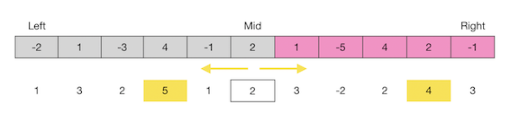

50. 


53. Maximum Subarray  --Easy

    Given an integer array `nums`, find the contiguous subarray (containing at least one number) which has the largest sum and return its sum.

    **Example:**

    ```
    Input: [-2,1,-3,4,-1,2,1,-5,4],
    Output: 6
    Explanation: [4,-1,2,1] has the largest sum = 6.
    ```

    **Follow up:**

    If you have figured out the O(*n*) solution, try coding another solution using the divide and conquer approach, which is more subtle

    **Solutions:**

    53.1 greedy  O(n)+O(1)

    ```java
    public static int maxSubArray(int[] nums) {
            int max = nums[0], sum = nums[0];
            for (int i = 1; i < nums.length; i++) {
                sum = Math.max(sum, sum + nums[i]);
                max = Math.max(max, sum);
            }
            return max;
        }
    ```

    53.2 dynamic programming  O(n)+O(n)

    ```java
    public static int maxSubArray(int[] nums) {
            int[] dp = new int[nums.length];
            dp[0] = nums[0];
            int max = nums[0];
            for (int i = 1; i < nums.length; i++) {
                dp[i] = Math.max(dp[i-1] + nums[i], nums[i]);
                max = Math.max(max, dp[i]);
            }
            return max;
        }
    ```

    53.3 divide and conquer: for the maximum subArray, there are three cases:

    		+ it is on the left part
    		+ it is on the right part
    		+ it it goes through the left and right part

    For every left and right parts, they can also be considered from three cases. Thus, we can use recursion to deal with. For the case that go through the middle, we can calculate the maximum sum from the middle element to left side and right side separately.

    

    ```java
    public static int maxSubArray4(int[] nums) {
            return maxSub(nums, 0, nums.length-1);
        }
    
        public static int maxSub(int[] nums, int left, int right){
            if (left==right)
                return nums[left];
            int mid = left+(right-left)/2;
            int leftMax = maxSub(nums, left, mid);
            int rightMax = maxSub(nums, mid+1, right);
            int leftSum = Integer.MIN_VALUE;
            int sum = 0;
            for (int i = mid; i >= left; i--)
            {
                sum += nums[i];
                leftSum = Math.max(leftSum, sum);
            }
            int rightSum = Integer.MIN_VALUE;
            sum = 0;
            for (int i = mid + 1; i <= right; i++)
            {
                sum += nums[i];
                rightSum = Math.max(rightSum, sum);
            }
            int midMax =  leftSum + rightSum;
            int result = Math.max(leftMax,rightMax);
            return Math.max(result,midMax);
        }
    ```


58. Length of Last Word   --Easy

    Given a string *s* consists of upper/lower-case alphabets and empty space characters `' '`, return the length of last word (last word means the last appearing word if we loop from left to right) in the string.

    If the last word does not exist, return 0.

    **Note:** A word is defined as a **maximal substring** consisting of non-space characters only.

    **Example:**

    ```
    Input: "Hello World"
    Output: 5
    ```

    **Solutions:**

    58.1 use split function

    ```java
    public static int lengthOfLastWord(String s) {
            String[] words = s.split(" ");
            if(words.length==0)
                return 0;
            return words[words.length-1].length();
        }
    ```

    58.2 use trim and traverse s

    ```java
    public static int lengthOfLastWord(String s) {
            s = s.trim();
            int end = s.length() - 1;
            while(end >= 0 && s.charAt(end) != ' ') end--;
            return s.length() - 1 - end;
        }
    ```


59. Spiral Matrix II  --Medium

    Given a positive integer *n*, generate a square matrix filled with elements from 1 to *n*2in spiral order.

    **Example:**

    ```
    Input: 3
    Output:
    [
     [ 1, 2, 3 ],
     [ 8, 9, 4 ],
     [ 7, 6, 5 ]
    ]
    ```

    **Solutions:**

    ```java
    public static int[][] generateMatrix(int n) {
            int k = 1;
            int[][] res = new int[n][n];
            int up = 0, right = n-1, left = 0, down = n-1;
            while(k<=n*n){
                // >->
                for (int l = left; l <= right ; l++)
                    res[up][l] = k++;
                up +=1;
                // |v|
                for (int l = up; l <= down ; l++)
                    res[l][right] = k++;
                right -= 1;
                // <-<
                for (int l = right; l >= left ; l--)
                    res[down][l] = k++;
                down-=1;
                // |^|
                for (int l = down; l >= up ; l--)
                    res[l][left] = k++;
                left += 1;
            }
            return res;
        }
    ```

    

88. 

61. 

62. 

63. 

64. 

65. 

66. 

67. 

68. 

69. 

70. 

71. 

72. 

73. 

74. 

75. 

76. 

77. 

78. 

79. Word Search  --Medium

    Given a 2D board and a word, find if the word exists in the grid.

    The word can be constructed from letters of sequentially adjacent cell, where "adjacent" cells are those horizontally or vertically neighboring. The same letter cell may not be used more than once.

    **Example:**

    ```
    board =
    [
      ['A','B','C','E'],
      ['S','F','C','S'],
      ['A','D','E','E']
    ]
    
    Given word = "ABCCED", return true.
    Given word = "SEE", return true.
    Given word = "ABCB", return false.
    ```

    **Constraints:**

    - `board` and `word` consists only of lowercase and uppercase English letters.
    - `1 <= board.length <= 200`
    - `1 <= board[i].length <= 200`
    - `1 <= word.length <= 10^3`

    **Solutions:**use dfs to backtracking whole array. the most important points are status marker and status reset.

    ```java
    class Solution {
      		private int[][] dirs = {{1,0},{-1,0},{0,1},{0,-1}};
        	private boolean[][] visit;
      		public boolean exist(char[][] board, String word) {
            		if (board==null || board.length==0 || word == null || word.length() ==0)
                		return false;
                int row = board.length;
                int col = board[0].length;
                visit = new boolean[row][col];
                if (word.length()>row*col)
                    return false;
                for (int i = 0; i < row; i++) {
                    for (int j = 0; j < col; j++) {
                        if (board[i][j] == word.charAt(0)) {
                            if(helper(board, word, i, j,0))
                            		return true;
                        }
                    }
                }
                return false;
        	}
      		
      		public boolean helper(char[][] board, String word, int i, int j,int count){
                if (word.length()-1==count)
                    return true;
                visit[i][j] = true;
                for (int k = 0; k < 4; k++) {
                    int rowd = i+dirs[k][0];
                    int cold = j+dirs[k][1];
                    if (rowd>=board.length || cold>=board[0].length || rowd<0 || cold<0 || visit[rowd][cold] || board[rowd][cold] !=word.charAt(count+1))
                        continue;
                    if (helper(board,word,rowd,cold,count+1))
                        return true;
                }
            visit[i][j] = false;
            return false;
        }
    }
    ```

    

    

    

    

    

80. 

81. 

82. 

83. 

84. 

85. 

86. 

87. 

88. Merge Sorted Array  --Easy

    Given two sorted integer arrays *nums1* and *nums2*, merge *nums2* into *nums1* as one sorted array.

    **Note:**

    - The number of elements initialized in *nums1* and *nums2* are *m* and *n*respectively.
    - You may assume that *nums1* has enough space (size that is **equal** to *m* + *n*) to hold additional elements from *nums2*.

    **Example:**

    ```
    Input:
    nums1 = [1,2,3,0,0,0], m = 3
    nums2 = [2,5,6],       n = 3
    
    Output: [1,2,2,3,5,6] 
    ```

    **Constraints:**

    - `-10^9 <= nums1[i], nums2[i] <= 10^9`
    - `nums1.length == m + n`
    - `nums2.length == n`

    **Solutions:** 

    88.1 Use another array to restore nums1. Then compare the first two integers of two arrays and insert the smaller one into the start of nums1.

    88.2 Do not use array sort function. Instead compare the last two integers of two arrays and insert the bigger one into the end of array.

    ```java
    public void merge(int[] nums1, int m, int[] nums2, int n) {
            int tail = m + n - 1, tail1 = m - 1, tail2 = n - 1;
            while (tail1>=0 && tail2>=0)
                nums1[tail--] = (nums1[tail1]>=nums2[tail2]) ? nums1[tail1--] : nums2[tail2--];
            while (tail2 >= 0) {
                nums1[tail2] = nums2[tail2--];
            }
        }
    ```


91. Decode Ways   --Medium

    A message containing letters from `A-Z` is being encoded to numbers using the following mapping:

    ```
    'A' -> 1
    'B' -> 2
    ...
    'Z' -> 26
    ```

    Given a **non-empty** string containing only digits, determine the total number of ways to decode it.

    **Example 1:**

    ```
    Input: "12"
    Output: 2
    Explanation: It could be decoded as "AB" (1 2) or "L" (12).
    ```

    **Example 2:**

    ```
    Input: "226"
    Output: 3
    Explanation: It could be decoded as "BZ" (2 26), "VF" (22 6), or "BBF" (2 2 6).
    ```


100. Same Tree   --Easy

     Given two binary trees, write a function to check if they are the same or not.

     Two binary trees are considered the same if they are structurally identical and the nodes have the same value.

     **Example 1:**

     ```
     Input:     1         1
               / \       / \
              2   3     2   3
     
             [1,2,3],   [1,2,3]
     
     Output: true
     ```

     **Example 2:**

     ```
     Input:     1         1
               /           \
              2             2
     
             [1,2],     [1,null,2]
     
     Output: false
     ```

     **Example 3:**

     ```
     Input:     1         1
               / \       / \
              2   1     1   2
     
             [1,2,1],   [1,1,2]
     
     Output: false
     ```

     **Solutions:**

     100.1 recursion

     ```java
     public boolean isSameTree(TreeNode p, TreeNode q) {
             if(p== null && q==null)
                 return true;
             else if(p == null || q == null)
                 return false;
             return p.val == q.val && isSameTree(p.left, q.left) && isSameTree(p.right, q.right);
         }
     ```

     100.2 simplified recursion

     ```java
     public boolean isSameTree(TreeNode p, TreeNode q) {
             if (p == null) return q == null;
             return p.val == q.val && isSameTree(p.left, q.left) && isSameTree(p.right, q.right);
         }
     ```

     