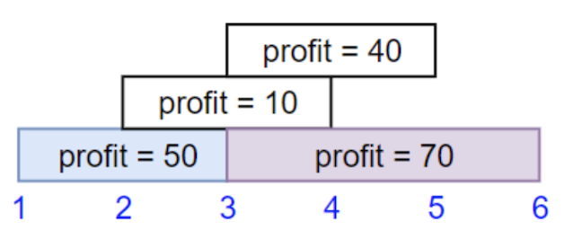
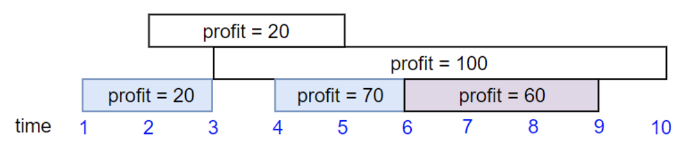
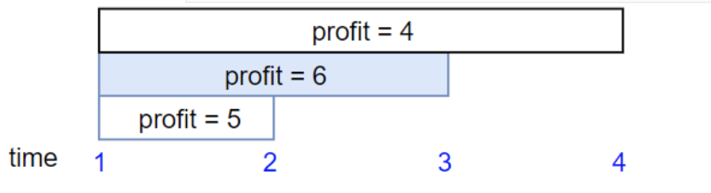

1235. Maximum Profit in Job Scheduling   --Hard

      We have `n` jobs, where every job is scheduled to be done from `startTime[i]` to `endTime[i]`, obtaining a profit of `profit[i]`.

      You're given the `startTime` , `endTime` and `profit` arrays, you need to output the maximum profit you can take such that there are no 2 jobs in the subset with overlapping time range.

      If you choose a job that ends at time `X` you will be able to start another job that starts at time `X`.

      **Example 1:**

      

```
Input: startTime = [1,2,3,3], endTime = [3,4,5,6], profit = [50,10,40,70]
Output: 120
Explanation: The subset chosen is the first and fourth job. 
Time range [1-3]+[3-6] , we get profit of 120 = 50 + 70.
```

**Example 2:**



```
Input: startTime = [1,2,3,4,6], endTime = [3,5,10,6,9], profit = [20,20,100,70,60]
Output: 150
Explanation: The subset chosen is the first, fourth and fifth job. 
Profit obtained 150 = 20 + 70 + 60.
```

**Example 3:**



```
Input: startTime = [1,1,1], endTime = [2,3,4], profit = [5,6,4]
Output: 6
```

**Constraints:**

- `1 <= startTime.length == endTime.length == profit.length <= 5 * 10^4`
- `1 <= startTime[i] < endTime[i] <= 10^9`
- `1 <= profit[i] <= 10^4`

**Solutions:** 

1. use a structure to record jobs with starttime, endtime and profits. Then sort by the end time from early to late.
2. use the idea of dynamic programming, dp[i] indicate for i jobs, the maximum profit we can arrange.
3. compare to i-1 jobs, for i^th^ job, we have two choices. One is choose it, another is not choose it. dp[i] equals to the larger one.
4. if we do not choose job i. the profit for i jobs is dp[i-1]. If we choose job i, we need to find the job with maximum endtime whose endtime is equal to or less than the starttime of job i.
5. return dp[n-1]

1235.1 use 2d array to record jobs information and use binary search to find j.  -- 40ms

```java
public int jobScheduling(int[] startTime, int[] endTime, int[] profit) {
        int n = profit.length;
        int[][] jobs = new int[n][3];
        for (int i = 0; i < n; i++) {
            jobs[i] = new int[]{startTime[i],endTime[i],profit[i]};
        }
        Arrays.sort(jobs,(a,b)->(a[1]-b[1]));   // sort by end time
        int[] dp = new int[profit.length];
        dp[0] = jobs[0][2];
        for (int i = 1; i < profit.length; i++) {
            // find the last valuable j
            int l = 0, r = i-1;
            while(l<r){
                int mid = (l + r + 1)/2;
                if(jobs[mid][1]<=jobs[i][0]) {  //mid's end < i's start
                    l = mid;
                }else{
                    r= mid - 1; // mid's end > i's start
                }
            }
            int j = (jobs[l][1] > jobs[i][0])? -1 : l;
            dp[i] = (j==-1)? Math.max(dp[i-1], jobs[i][2]):Math.max(dp[i-1], dp[j] + jobs[i][2]);
        }
        return dp[n-1];
    }
```

1235.2 use a class to record jobs information and find j from back to front.  --11ms

```java
class Jobs {
        int startTime;
        int endTime;
        int profit;

        Jobs(int s, int e, int p) {
            startTime = s;
            endTime = e;
            profit = p;
        }

    }
public int jobScheduling(int[] startTime, int[] endTime, int[] profit) {
        int n = profit.length;
        Jobs[] jobs = new Jobs[n];
        for (int i = 0; i < n; i++) {
        	jobs[i] = new Jobs(startTime[i],endTime[i],profit[i]);
        }
        Arrays.sort(jobs,(a,b)->(a.endTime-b.endTime));
        int[] dp = new int[profit.length];
        dp[0] = jobs[0].profit;
        for (int i = 1; i < profit.length; i++) {
          int tar = -1;
          for (int j = i-1; j >=0; j--) {
            if (jobs[j].endTime<=jobs[i].startTime){
              tar = j;
              break;
            }
          }
          dp[i] = (tar==-1)?Math.max(dp[i-1],jobs[i].profit):Math.max(dp[i-1],jobs[i].profit+dp[tar]);
        }
        return dp[n-1];
}
```

