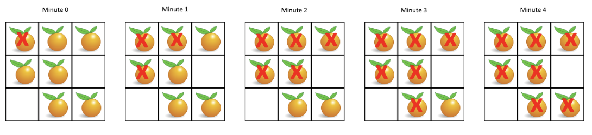

994. Rotting Oranges   --Medium

     In a given grid, each cell can have one of three values:

     - the value `0` representing an empty cell;
     - the value `1` representing a fresh orange;
     - the value `2` representing a rotten orange.

     Every minute, any fresh orange that is adjacent (4-directionally) to a rotten orange becomes rotten.

     Return the minimum number of minutes that must elapse until no cell has a fresh orange. If this is impossible, return `-1` instead.

     **Example 1:**

     

     ```
     Input: [[2,1,1],[1,1,0],[0,1,1]]
     Output: 4
     ```

     **Example 2:**

     ```
     Input: [[2,1,1],[0,1,1],[1,0,1]]
     Output: -1
     Explanation:  The orange in the bottom left corner (row 2, column 0) is never rotten, because rotting only happens 4-directionally.
     ```

     **Example 3:**

     ```
     Input: [[0,2]]
     Output: 0
     Explanation:  Since there are already no fresh oranges at minute 0, the answer is just 0.
     ```

     **Note:**

     1. `1 <= grid.length <= 10`
     2. `1 <= grid[0].length <= 10`
     3. `grid[i][j]` is only `0`, `1`, or `2`.

     **Solutions:**

     994.1.1 BFS

     ```java
     public int orangesRotting(int[][] grid) {
             Queue<int[]> q = new ArrayDeque<>();
             int row = grid.length, col = grid[0].length;
             int count = 0;
             for (int i = 0; i < row; i++) {
                 for (int j = 0; j < col; j++) {
                     if (grid[i][j] == 1)          //record the number of fresh
                         count++;
                     if (grid[i][j] == 2)          //rotten oranges into queue
                         q.add(new int[]{i, j});
                 }
             }
             int res = 0, count2 = 0;
             while (!q.isEmpty() && count2 < count) {
                 res++;
                 int len = q.size();
                 for (int i = 0; i < len; i++) {
                     int[] fresh = q.poll();
                     if (fresh[0] - 1 >= 0 && grid[fresh[0] - 1][fresh[1]] == 1) {
                         grid[fresh[0]-1][fresh[1]] = 2;
                         q.add(new int[]{fresh[0]-1,fresh[1]});
                         count2++;
                     }
                     if (fresh[0] + 1 < row && grid[fresh[0] + 1][fresh[1]] == 1) {
                         grid[fresh[0] + 1][fresh[1]] = 2;
                         q.add(new int[]{fresh[0]+1,fresh[1]});
                         count2++;
                     }
                     if (fresh[1] - 1 >= 0 && grid[fresh[0]][fresh[1] - 1] == 1) {
                         grid[fresh[0]][fresh[1] - 1] = 2;
                         q.add(new int[]{fresh[0], fresh[1] - 1});
                         count2++;
                     }
                     if (fresh[1] + 1 < col && grid[fresh[0]][fresh[1] + 1] == 1) {
                         grid[fresh[0]][fresh[1] + 1] = 2;
                         q.add(new int[]{fresh[0],fresh[1]+1});
                         count2++;
                     }
                 }
             }
             if (count2==count)
                 return res;
             else
                 return -1;
         }
     ```

     994.1.2 simplified BFS

     ```java
     public int orangesRotting(int[][] grid) {
             Queue<int[]> q = new ArrayDeque<>();
             int row = grid.length, col = grid[0].length;
             int count = 0;
             for (int i = 0; i < row; i++) {
                 for (int j = 0; j < col; j++) {
                     if (grid[i][j] == 1)
                         count++;
                     if (grid[i][j] == 2)             
                         q.add(new int[]{i, j});
                 }
             }
             int res = 0, count2 = 0;
       			int[][] dirs = {{1,0},{-1,0},{0,1},{0,-1}};  //use a 2d array to record 4 directions
             while (!q.isEmpty() && count2 < count) {
                 res++;
                 int len = q.size();
                 for (int i = 0; i < len; i++) {
                     int[] fresh = q.poll();
                  		for(int dir[] : dirs) {
                       	int x = fresh[0] + dir[0];
                         int y = fresh[1] + dir[1];
                       	if(x < 0 || y < 0 || x >= row || y >= col || grid[x][y] == 0 || grid[x][y] == 2) continue;
                       	grid[x][y] = 2;
                       	q.add(new int[]{x , y});
                       	count2++;
                     }
                 }
             }
             if (count2==count)
                 return res;
             else
                 return -1;
         }
     ```

     